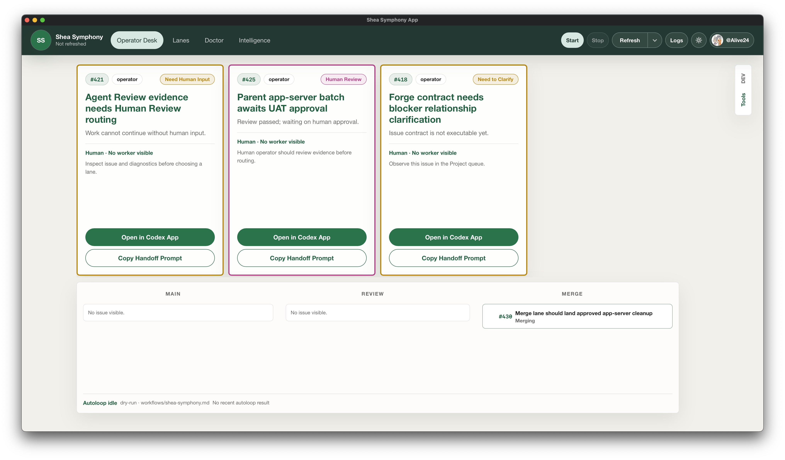
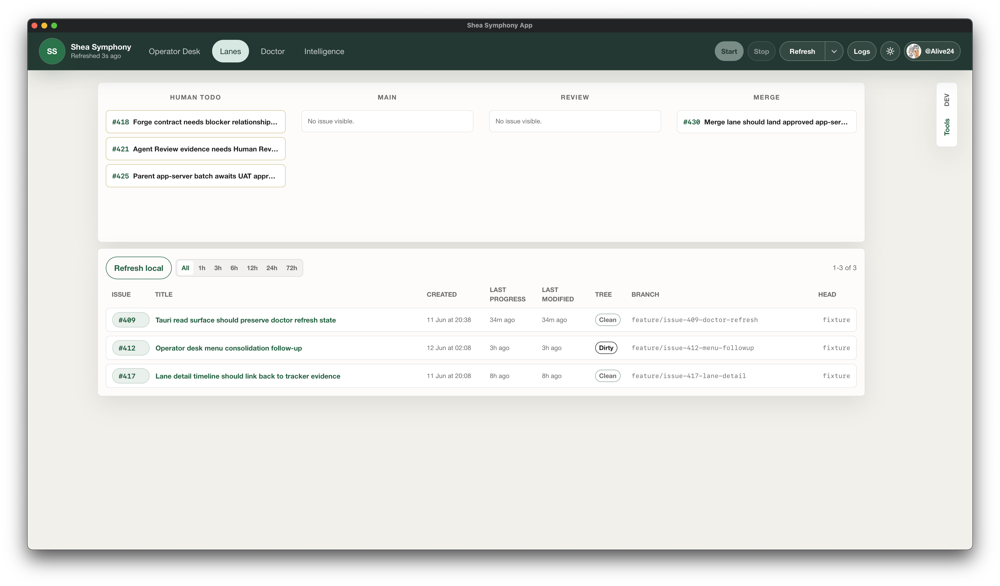
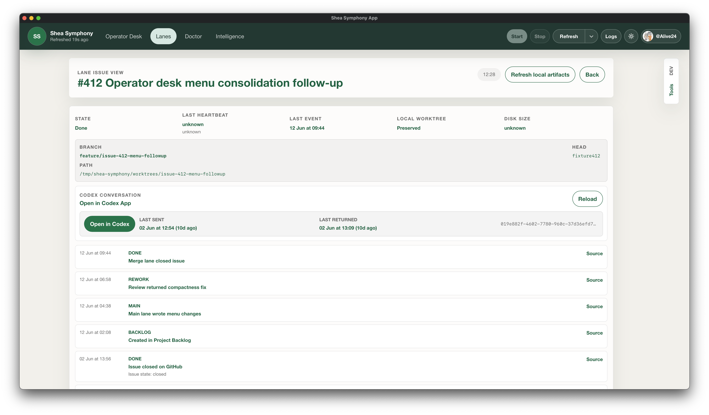
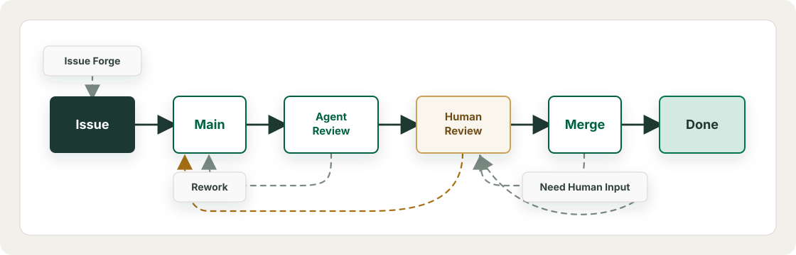

# Shea Symphony

Shea Symphony is an opinionated and extended Rust implementation with GUI of OpenAI Symphony orchestration system to make it also work for small teams of humans that want to start building AI-native engineering workflows in a responsible and manageable way.

> ## Milestone Note: 2606 MVP
>
> The 2606 MVP is a local Rust/CLI-first and desktop-observable implementation. It has been self-dogfooded on Shea Symphony itself and used to help build external projects. See [What 2606 MVP Demonstrates](#what-2606-mvp-demonstrates) for more details.
>
> The next milestone is 2607 Hardening which aims to harden the runtime:
>
> - Further separate Symphony runtime responsibilities from Shea extensions;
> - Replace prototyped lane/autopilot loops with Temporal architecture for reliability, maintainability, and observability;
>   - Workflow coordination and orchestration;
>   - Activity definition and dispatching
>   - Worker supervision and lifecycle management
>   - Temporal Message (start, Query, Signal, and Update) operations for workflow state management and coordination;
>   - Temporal History for audit, self-improvement, and debugging;
> - Keep tracker as durable queue/external state but use SQLite as local read model and active workflow index for user experience;
> - UI/UX improvements for workflow/template/prompt/skill management and configuration;

## Desktop App

The desktop app is the operator cockpit for observing queues, Human Todo, active lane work, local worktrees, and issue-level evidence without requiring a terminal expedition.



The Lanes view shows the current Human Todo queue, active lane work, and local issue worktrees in one operator-readable surface.



LaneIssueView drills into one issue with tracker state, local worktree provenance, Codex handoff links, and lifecycle evidence.



## TLDR: Beyond OpenAI Symphony

### Extension Principles

- Leave the Harness Alone: Do not interfere with how Codex or Claude Code work and evolve.
- Team Workflow: Also scale in quality and productivity with more human operators.
- Human Input: Human can help more by writing better issues and providing feedback.

### How Humans Use It

After setting up Shea Symphony, the desired human workflow looks like this:

1. Use "issue-forge-skill" to discuss your ideas and observation in any agent session to set up issues directly
2. Use "issue-forge-reflect-skill" to record sparse ideas into backlogs, collect ideas from previous work, and promote existing backlogs.
3. Use "human-review" skill for issues waiting for the last UATs before getting approved for merging
4. Use "doctor" skill for issues that requires human input to recover.

### Extension Modules

#### Issue Forge

- A "grill-me" style dialectical experience activated by a configurable skill for the operator to shape ideas into executable issue contracts.
- An issue quality gate before dispatch to ensure the issue is clear enough to dispatch.
- A reflective skill to collect sparse backlog candidates from recent sessions or deep "dreaming logs" and promote them into executable issue contracts.

#### Lane Model

- Configurable backends and prompts for Main, Review, and Merge lanes.
- Configurable handoff templates
- Switch between Autoloop and Manual mode for fine control

#### CLI Toolkit (2606 MVP, To be replaced by Temporal in 2607 Hardening)

- MVP Runtime CLI for orchestration and debugging.
- Consistent state machine powered by tracker and mutation behaviors across all lanes.
- Workspace management and session restoration for interrupted runs.

#### Additional Features

- GitHub Project v2 tracker state machines (Linear planned);
- parent/subissue branch topology;
- Doctor diagnostics for stuck states;
- repo-owned skills for conversational operator workflows;

---

## Overview

Codex and Claude Code are good at coding in a session, OpenAI Symphony simplifies the orchestration for a complete workflow with shared state, Shea Symphony makes the orchestration consistent, reliable, mindful, and collaborative.

A real team needs a way to say that a slice of work is:

- **Dispatchable**: clear and meaningful enough to dispatch;
- **Isolated**: claimed by the right agent in the right environment;
- **Worths Attention**: sufficiently reviewed by agents and worth human attention;
- **Contextual for Review and Approval**: providing human with sufficient information and guidance to provide feedback and approve;
- **Mergeable Automatically**: mergeable directly or assisted by agents, and only requires human intervention when there sematic conflicts;
- **Recoverable**: able to restore state, progress, and runtime when stopped no matter how, or restart atomically;
- **Tracked Semantically**: tracked in the backlog and promotable into issues later if not fully dispatchable yet.

<!--  -->

The tracker stays the shared source of truth. Local artifacts, worktrees, logs, and session records exist to make the tracker state explainable and recoverable, not to replace it.

- **Issue Forge** shapes rough work into executable issues.
- **Main lane** implements one issue in an isolated workspace and stops at `Agent Review`.
- **Review lane** performs independent agent review and records pass or rework evidence.
- **Human Review** gives the operator a structured approval checkpoint.
- **Merge lane** lands approved PRs, repairs safe mechanical drift, and routes real uncertainty to `Need Human Input`.
- **Workpads and timeline evidence** keep the issue readable after the run.
- **Doctor and status surfaces** explain stuck states without requiring a low-level log expedition.
- **Dream and Reflect skills** mine recent work into safe Backlog candidates before they become executable Todo issues.

The intended feeling is closer to a team cockpit than a prompt runner. You should be able to leave work moving, come back later, and understand what happened from the issue, PR, workpad, and status output.

## The Lane Model

Shea Symphony separates work by authority.

### Main Lane

The Main lane is for implementation. It claims a Todo or Rework issue, prepares or resumes an isolated worktree, runs the configured agent backend, verifies the change, opens or reuses a PR, records the Main Workpad, and stops at `Agent Review`.

The Main agent must not approve its own work.

The canonical workflow now defaults Main execution to Codex app-server. tmux remains available as an explicit fallback/debug substrate, but it is no longer the primary unattended direction.

### Review Lane

The Review lane is independent review. In the current dogfood path, automatic review uses headless `agy` CLI and records a durable review job ledger plus a human-readable issue comment.

Passing review can route ordinary issues to `Human Review`. Routine native subissues can route directly to `Merging` when the parent issue owns final UAT. Confirmed findings route to `Rework`.

### Human Review

Human Review is not ceremonial. It is the place where the operator checks the issue, PR, review evidence, and UAT expectations before approving the work for merge.

Human Review is intentionally skill-guided: the operator should get a briefing, understand what changed, run or inspect the right checks, and then make an explicit decision.

### Merge Lane

The Merge lane owns landing approved work. Clean merges stay direct CLI behavior; they do not need an LLM. Behind PRs can be updated and retried. Mechanical conflict repair should stay inside the merge lane when safe.

`Need Human Input` is reserved for semantic uncertainty, unsafe state, verification failure, missing evidence, or infrastructure failures that need an operator decision.

Merge repair should not erase the fact that the issue already passed Agent Review and Human Review. It should preserve reviewed intent, record what changed, and land only when the result is still safe.

## Evidence Surfaces

Shea Symphony is opinionated about evidence because agent work without evidence turns into archaeology.

- The **issue body** is the contract.
- The **Main Workpad** is the current implementation surface.
- **Timeline comments** record Review, Human Review, Merge, Rework, and Doctor events.
- The **PR** is the code handoff and must be visible through linked-PR readback.
- **Local artifacts** store prompts, app-server protocol output, stderr, normalized events, review ledgers, and session registry records.
- **Doctor** connects tracker state, runtime state, and local evidence into a readable diagnosis.

The goal is not to keep every byte forever. The goal is that a human can answer "what happened here?" without guessing.

## Design Boundaries

Shea Symphony is orchestration infrastructure. It should not contain downstream application business logic. Domain work belongs in tracked issues and isolated issue workspaces.

The tracker is the operating source of truth. Local runtime files make tracker state recoverable and auditable, but lane decisions should refresh live tracker state before claiming, reviewing, or merging work.

Role boundaries matter:

- Main implementation stops at `Agent Review`.
- Review evidence gates movement toward `Human Review` or `Merging`.
- Human approval gates ordinary merges.
- Merge repair stays in the merge lane unless it needs a real human decision.
- Dream and Reflect output is advisory until promoted into an issue contract.

Write-mode commands should record evidence before state transitions, preserve claims and audit records, and fail closed when the safe next action is unclear.

## What 2606 MVP Demonstrates

The current workflow can:

- load and validate workflow files;
- read GitHub Project v2 tracker state;
- validate issue contracts before dispatch;
- create and promote tracker issues through Forge;
- run bounded Main, Review, and Merge lane ticks;
- use Codex app-server for Main execution;
- use headless `agy` for Review execution;
- create isolated issue worktrees and PR handoffs;
- preserve Main workpads and lane timeline evidence;
- recover interrupted Main and Merge lane work by default;
- inspect runtime/session status;
- diagnose tracker, PR, worktree, skill, runtime, and lane-state problems;
- plan future all-lane autoloop actions without mutating state.

It has been developing with self-dogfooding, and helped built some external projects with this command:

```bash
npm run tauri -- dev -- --workdir $YOUR_PROJECT_PATH
```
