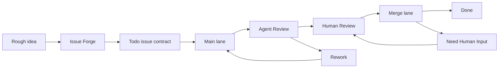

# GitHub Design Evidence: Alive24/shea-symphony

Source: https://github.com/Alive24/shea-symphony
Read method: git-clone
Local clone method: git clone
Ref: default branch
Repository paths discovered: 275
Snapshot files written: 47

## Intake Status

- This-device intake was used through local git or GitHub CLI.

## README (README.md)

```md
# Shea Symphony

Shea Symphony is a team workflow system for supervised AI-native engineering.

It helps a human operator turn rough engineering intent into issue contracts,
run implementation agents in isolated workspaces, request independent agent
review, preserve audit evidence, and land approved pull requests through a
guarded merge lane.

It is inspired by OpenAI Symphony, but the focus here is not just launching an
agent. The focus is the whole team loop around the agent:

- what work is safe to start;
- who or what currently owns it;
- where the implementation happened;
- which evidence proves it is ready;
- when a human must decide;
- how the merge should be repaired, retried, or stopped.

Current maturity: **supervised team-workflow dogfood**. Shea Symphony can run
bounded Main, Review, and Merge lane ticks against a live tracker. It is moving
toward all-lane autopilot, but write-mode automation is still deliberately
observable, bounded, and operator-led.

## The Short Version

Modern coding agents are good at making changes. Teams need more than that.

A real team needs a way to say:

- this issue is clear enough to dispatch;
- this agent is allowed to work on it;
- this work happened in the right branch and worktree;
- this PR was independently reviewed;
- this human approval was recorded;
- this merge failure is mechanical, semantic, or blocked;
- this run can be resumed without guessing.

Shea Symphony turns those questions into a workflow.



The tracker stays the shared source of truth. Local artifacts, worktrees, logs,
and session records exist to make the tracker state explainable and recoverable,
not to replace it.

## How People Use It

Shea Symphony is designed around a human operator, not a hidden daemon.

The operator can ask:

1. What is ready to work on?
2. What is blocked or ambiguous?
3. Which lane should run next?
4. Did the agent leave enough evidence?
5. Is this safe to approve, repair, or merge?

The system answers through a few surfaces:

- **Issue Forge** shapes rough work into executable issues.
- **Main lane** implements 
...
```

## Source Evidence Inventory

### Product docs and manifests

Use these to understand product purpose, dependency stack, scripts, and public naming.

- docs/bootstrap/README.md -> `context/github/Alive24-shea-symphony/files/docs/bootstrap/README.md` (source)
- examples/README.md -> `context/github/Alive24-shea-symphony/files/examples/README.md` (source)
- skills/shea-symphony/README.md -> `context/github/Alive24-shea-symphony/files/skills/shea-symphony/README.md` (source)
- workflows/README.md -> `context/github/Alive24-shea-symphony/files/workflows/README.md` (source)

### Other design evidence

Inspect these only after the primary design evidence above has been used.

- .codex/skills/shea-symphony-doctor/SKILL.md -> `context/github/Alive24-shea-symphony/files/.codex/skills/shea-symphony-doctor/SKILL.md` (source)
- .codex/skills/shea-symphony-human-review/SKILL.md -> `context/github/Alive24-shea-symphony/files/.codex/skills/shea-symphony-human-review/SKILL.md` (source)
- .codex/skills/shea-symphony-issue-forge-dream/SKILL.md -> `context/github/Alive24-shea-symphony/files/.codex/skills/shea-symphony-issue-forge-dream/SKILL.md` (source)
- .codex/skills/shea-symphony-issue-forge-reflect/SKILL.md -> `context/github/Alive24-shea-symphony/files/.codex/skills/shea-symphony-issue-forge-reflect/SKILL.md` (source)
- .codex/skills/shea-symphony-issue-forge/SKILL.md -> `context/github/Alive24-shea-symphony/files/.codex/skills/shea-symphony-issue-forge/SKILL.md` (source)
- .codex/skills/shea-symphony-manual-main/SKILL.md -> `context/github/Alive24-shea-symphony/files/.codex/skills/shea-symphony-manual-main/SKILL.md` (source)
- .codex/skills/shea-symphony-manual-merge/SKILL.md -> `context/github/Alive24-shea-symphony/files/.codex/skills/shea-symphony-manual-merge/SKILL.md` (source)
- .codex/skills/shea-symphony-manual-review/SKILL.md -> `context/github/Alive24-shea-symphony/files/.codex/skills/shea-symphony-manual-review/SKILL.md` (source)
- docs/artifact-storage-policy.md -> `context/github/Alive24-shea-symphony/files/docs/artifact-storage-policy.md` (source)
- docs/bootstrap-parity-audit.md -> `context/github/Alive24-shea-symphony/files/docs/bootstrap-parity-audit.md` (source)
- docs/bootstrap/ISSUE_QUALITY_GATE_TEMPLATE.md -> `context/github/Alive24-shea-symphony/files/docs/bootstrap/ISSUE_QUALITY_GATE_TEMPLATE.md` (source)
- docs/bootstrap/OFFICIAL_REFERENCE_INDEX.md -> `context/github/Alive24-shea-symphony/files/docs/bootstrap/OFFICIAL_REFERENCE_INDEX.md` (source)
- docs/bootstrap/SHEA_SYMPHONY_SPEC.md -> `context/github/Alive24-shea-symphony/files/docs/bootstrap/SHEA_SYMPHONY_SPEC.md` (source)
- docs/bootstrap/SHEA_WORKFLOW.md -> `context/github/Alive24-shea-symphony/files/docs/bootstrap/SHEA_WORKFLOW.md` (source)
- docs/bootstrap/TRACKER_GITHUB_PROJECT_V2.md -> `context/github/Alive24-shea-symphony/files/docs/bootstrap/TRACKER_GITHUB_PROJECT_V2.md` (source)
- docs/cli-command-reference.md -> `context/github/Alive24-shea-symphony/files/docs/cli-command-reference.md` (source)
- docs/codex-app-server-transport.md -> `context/github/Alive24-shea-symphony/files/docs/codex-app-server-transport.md` (source)
- docs/dogfood-readiness.md -> `context/github/Alive24-shea-symphony/files/docs/dogfood-readiness.md` (source)
- docs/dream-log/2026-05-18-01-issue-295-dream-skill-rehearsal/created-backlog.md -> `context/github/Alive24-shea-symphony/files/docs/dream-log/2026-05-18-01-issue-295-dream-skill-rehearsal/created-backlog.md` (source)
- docs/dream-log/2026-05-18-01-issue-295-dream-skill-rehearsal/gemini-review.md -> `context/github/Alive24-shea-symphony/files/docs/dream-log/2026-05-18-01-issue-295-dream-skill-rehearsal/gemini-review.md` (source)
- docs/dream-log/2026-05-18-01-issue-295-dream-skill-rehearsal/RUN.md -> `context/github/Alive24-shea-symphony/files/docs/dream-log/2026-05-18-01-issue-295-dream-skill-rehearsal/RUN.md` (source)
- docs/dream-log/2026-05-18-01-issue-295-dream-skill-rehearsal/topic-runtime-recovery.md -> `context/github/Alive24-shea-symphony/files/docs/dream-log/2026-05-18-01-issue-295-dream-skill-rehearsal/topic-runtime-recovery.md` (source)
- docs/dream-log/2026-05-18-02-dream-cli-skill-drift/created-backlog.md -> `context/github/Alive24-shea-symphony/files/docs/dream-log/2026-05-18-02-dream-cli-skill-drift/created-backlog.md` (source)
- docs/dream-log/2026-05-18-02-dream-cli-skill-drift/gemini-review.md -> `context/github/Alive24-shea-symphony/files/docs/dream-log/2026-05-18-02-dream-cli-skill-drift/gemini-review.md` (source)
- docs/dream-log/2026-05-18-02-dream-cli-skill-drift/RUN.md -> `context/github/Alive24-shea-symphony/files/docs/dream-log/2026-05-18-02-dream-cli-skill-drift/RUN.md` (source)
- docs/dream-log/2026-05-18-02-dream-cli-skill-drift/topic-cli-skill-drift.md -> `context/github/Alive24-shea-symphony/files/docs/dream-log/2026-05-18-02-dream-cli-skill-drift/topic-cli-skill-drift.md` (source)
- docs/dream-log/2026-05-19-01-openai-symphony-parity/created-backlog.md -> `context/github/Alive24-shea-symphony/files/docs/dream-log/2026-05-19-01-openai-symphony-parity/created-backlog.md` (source)
- docs/dream-log/2026-05-19-01-openai-symphony-parity/gemini-review.md -> `context/github/Alive24-shea-symphony/files/docs/dream-log/2026-05-19-01-openai-symphony-parity/gemini-review.md` (source)
- docs/dream-log/2026-05-19-01-openai-symphony-parity/RUN.md -> `context/github/Alive24-shea-symphony/files/docs/dream-log/2026-05-19-01-openai-symphony-parity/RUN.md` (source)
- docs/dream-log/2026-05-19-01-openai-symphony-parity/topic-openai-symphony-parity.md -> `context/github/Alive24-shea-symphony/files/docs/dream-log/2026-05-19-01-openai-symphony-parity/topic-openai-symphony-parity.md` (source)
- docs/dream-log/2026-05-19-02-worker-supervision-parity/created-backlog.md -> `context/github/Alive24-shea-symphony/files/docs/dream-log/2026-05-19-02-worker-supervision-parity/created-backlog.md` (source)
- docs/dream-log/2026-05-19-02-worker-supervision-parity/gemini-review.md -> `context/github/Alive24-shea-symphony/files/docs/dream-log/2026-05-19-02-worker-supervision-parity/gemini-review.md` (source)
- docs/dream-log/2026-05-19-02-worker-supervision-parity/RUN.md -> `context/github/Alive24-shea-symphony/files/docs/dream-log/2026-05-19-02-worker-supervision-parity/RUN.md` (source)
- docs/dream-log/2026-05-19-02-worker-supervision-parity/topic-worker-supervision.md -> `context/github/Alive24-shea-symphony/files/docs/dream-log/2026-05-19-02-worker-supervision-parity/topic-worker-supervision.md` (source)
- docs/dream-log/2026-05-19-03-ssh-worker-workspaces/created-backlog.md -> `context/github/Alive24-shea-symphony/files/docs/dream-log/2026-05-19-03-ssh-worker-workspaces/created-backlog.md` (source)
- docs/dream-log/2026-05-19-03-ssh-worker-workspaces/gemini-review.md -> `context/github/Alive24-shea-symphony/files/docs/dream-log/2026-05-19-03-ssh-worker-workspaces/gemini-review.md` (source)
- docs/dream-log/2026-05-19-03-ssh-worker-workspaces/RUN.md -> `context/github/Alive24-shea-symphony/files/docs/dream-log/2026-05-19-03-ssh-worker-workspaces/RUN.md` (source)
- docs/dream-log/2026-05-19-03-ssh-worker-workspaces/topic-ssh-worker-workspaces.md -> `context/github/Alive24-shea-symphony/files/docs/dream-log/2026-05-19-03-ssh-worker-workspaces/topic-ssh-worker-workspaces.md` (source)
- docs/dream-log/2026-05-19-04-final-parity-audit/created-backlog.md -> `context/github/Alive24-shea-symphony/files/docs/dream-log/2026-05-19-04-final-parity-audit/created-backlog.md` (source)
- docs/dream-log/2026-05-19-04-final-parity-audit/gemini-review.md -> `context/github/Alive24-shea-symphony/files/docs/dream-log/2026-05-19-04-final-parity-audit/gemini-review.md` (source)
- docs/dream-log/2026-05-19-04-final-parity-audit/RUN.md -> `context/github/Alive24-shea-symphony/files/docs/dream-log/2026-05-19-04-final-parity-audit/RUN.md` (source)
- docs/dream-log/2026-05-19-04-final-parity-audit/topic-final-parity-audit.md -> `context/github/Alive24-shea-symphony/files/docs/dream-log/2026-05-19-04-final-parity-audit/topic-final-parity-audit.md` (source)
- docs/dream-log/2026-05-23-01-post-app-server-dogfood-backlog/created-backlog.md -> `context/github/Alive24-shea-symphony/files/docs/dream-log/2026-05-23-01-post-app-server-dogfood-backlog/created-backlog.md` (source)


## Files Inspected

- docs/bootstrap/README.md -> `context/github/Alive24-shea-symphony/files/docs/bootstrap/README.md` (1339 bytes, git-clone)
- examples/README.md -> `context/github/Alive24-shea-symphony/files/examples/README.md` (5256 bytes, git-clone)
- skills/shea-symphony/README.md -> `context/github/Alive24-shea-symphony/files/skills/shea-symphony/README.md` (3982 bytes, git-clone)
- workflows/README.md -> `context/github/Alive24-shea-symphony/files/workflows/README.md` (5893 bytes, git-clone)
- .codex/skills/shea-symphony-doctor/SKILL.md -> `context/github/Alive24-shea-symphony/files/.codex/skills/shea-symphony-doctor/SKILL.md` (3751 bytes, git-clone)
- .codex/skills/shea-symphony-human-review/SKILL.md -> `context/github/Alive24-shea-symphony/files/.codex/skills/shea-symphony-human-review/SKILL.md` (15855 bytes, git-clone)
- .codex/skills/shea-symphony-issue-forge-dream/SKILL.md -> `context/github/Alive24-shea-symphony/files/.codex/skills/shea-symphony-issue-forge-dream/SKILL.md` (10562 bytes, git-clone)
- .codex/skills/shea-symphony-issue-forge-reflect/SKILL.md -> `context/github/Alive24-shea-symphony/files/.codex/skills/shea-symphony-issue-forge-reflect/SKILL.md` (7202 bytes, git-clone)
- .codex/skills/shea-symphony-issue-forge/SKILL.md -> `context/github/Alive24-shea-symphony/files/.codex/skills/shea-symphony-issue-forge/SKILL.md` (7051 bytes, git-clone)
- .codex/skills/shea-symphony-manual-main/SKILL.md -> `context/github/Alive24-shea-symphony/files/.codex/skills/shea-symphony-manual-main/SKILL.md` (8924 bytes, git-clone)
- .codex/skills/shea-symphony-manual-merge/SKILL.md -> `context/github/Alive24-shea-symphony/files/.codex/skills/shea-symphony-manual-merge/SKILL.md` (8273 bytes, git-clone)
- .codex/skills/shea-symphony-manual-review/SKILL.md -> `context/github/Alive24-shea-symphony/files/.codex/skills/shea-symphony-manual-review/SKILL.md` (7026 bytes, git-clone)
- docs/artifact-storage-policy.md -> `context/github/Alive24-shea-symphony/files/docs/artifact-storage-policy.md` (5542 bytes, git-clone)
- docs/bootstrap-parity-audit.md -> `context/github/Alive24-shea-symphony/files/docs/bootstrap-parity-audit.md` (7729 bytes, git-clone)
- docs/bootstrap/ISSUE_QUALITY_GATE_TEMPLATE.md -> `context/github/Alive24-shea-symphony/files/docs/bootstrap/ISSUE_QUALITY_GATE_TEMPLATE.md` (4452 bytes, git-clone)
- docs/bootstrap/OFFICIAL_REFERENCE_INDEX.md -> `context/github/Alive24-shea-symphony/files/docs/bootstrap/OFFICIAL_REFERENCE_INDEX.md` (2720 bytes, git-clone)
- docs/bootstrap/SHEA_SYMPHONY_SPEC.md -> `context/github/Alive24-shea-symphony/files/docs/bootstrap/SHEA_SYMPHONY_SPEC.md` (12309 bytes, git-clone)
- docs/bootstrap/SHEA_WORKFLOW.md -> `context/github/Alive24-shea-symphony/files/docs/bootstrap/SHEA_WORKFLOW.md` (8574 bytes, git-clone)
- docs/bootstrap/TRACKER_GITHUB_PROJECT_V2.md -> `context/github/Alive24-shea-symphony/files/docs/bootstrap/TRACKER_GITHUB_PROJECT_V2.md` (6512 bytes, git-clone)
- docs/cli-command-reference.md -> `context/github/Alive24-shea-symphony/files/docs/cli-command-reference.md` (46126 bytes, git-clone)
- docs/codex-app-server-transport.md -> `context/github/Alive24-shea-symphony/files/docs/codex-app-server-transport.md` (2656 bytes, git-clone)
- docs/dogfood-readiness.md -> `context/github/Alive24-shea-symphony/files/docs/dogfood-readiness.md` (48116 bytes, git-clone)
- docs/dream-log/2026-05-18-01-issue-295-dream-skill-rehearsal/created-backlog.md -> `context/github/Alive24-shea-symphony/files/docs/dream-log/2026-05-18-01-issue-295-dream-skill-rehearsal/created-backlog.md` (1131 bytes, git-clone)
- docs/dream-log/2026-05-18-01-issue-295-dream-skill-rehearsal/gemini-review.md -> `context/github/Alive24-shea-symphony/files/docs/dream-log/2026-05-18-01-issue-295-dream-skill-rehearsal/gemini-review.md` (958 bytes, git-clone)
- docs/dream-log/2026-05-18-01-issue-295-dream-skill-rehearsal/RUN.md -> `context/github/Alive24-shea-symphony/files/docs/dream-log/2026-05-18-01-issue-295-dream-skill-rehearsal/RUN.md` (2851 bytes, git-clone)
- docs/dream-log/2026-05-18-01-issue-295-dream-skill-rehearsal/topic-runtime-recovery.md -> `context/github/Alive24-shea-symphony/files/docs/dream-log/2026-05-18-01-issue-295-dream-skill-rehearsal/topic-runtime-recovery.md` (2499 bytes, git-clone)
- docs/dream-log/2026-05-18-02-dream-cli-skill-drift/created-backlog.md -> `context/github/Alive24-shea-symphony/files/docs/dream-log/2026-05-18-02-dream-cli-skill-drift/created-backlog.md` (847 bytes, git-clone)
- docs/dream-log/2026-05-18-02-dream-cli-skill-drift/gemini-review.md -> `context/github/Alive24-shea-symphony/files/docs/dream-log/2026-05-18-02-dream-cli-skill-drift/gemini-review.md` (1156 bytes, git-clone)
- docs/dream-log/2026-05-18-02-dream-cli-skill-drift/RUN.md -> `context/github/Alive24-shea-symphony/files/docs/dream-log/2026-05-18-02-dream-cli-skill-drift/RUN.md` (5116 bytes, git-clone)
- docs/dream-log/2026-05-18-02-dream-cli-skill-drift/topic-cli-skill-drift.md -> `context/github/Alive24-shea-symphony/files/docs/dream-log/2026-05-18-02-dream-cli-skill-drift/topic-cli-skill-drift.md` (2987 bytes, git-clone)
- docs/dream-log/2026-05-19-01-openai-symphony-parity/created-backlog.md -> `context/github/Alive24-shea-symphony/files/docs/dream-log/2026-05-19-01-openai-symphony-parity/created-backlog.md` (1220 bytes, git-clone)
- docs/dream-log/2026-05-19-01-openai-symphony-parity/gemini-review.md -> `context/github/Alive24-shea-symphony/files/docs/dream-log/2026-05-19-01-openai-symphony-parity/gemini-review.md` (1118 bytes, git-clone)
- docs/dream-log/2026-05-19-01-openai-symphony-parity/RUN.md -> `context/github/Alive24-shea-symphony/files/docs/dream-log/2026-05-19-01-openai-symphony-parity/RUN.md` (5297 bytes, git-clone)
- docs/dream-log/2026-05-19-01-openai-symphony-parity/topic-openai-symphony-parity.md -> `context/github/Alive24-shea-symphony/files/docs/dream-log/2026-05-19-01-openai-symphony-parity/topic-openai-symphony-parity.md` (4307 bytes, git-clone)
- docs/dream-log/2026-05-19-02-worker-supervision-parity/created-backlog.md -> `context/github/Alive24-shea-symphony/files/docs/dream-log/2026-05-19-02-worker-supervision-parity/created-backlog.md` (513 bytes, git-clone)
- docs/dream-log/2026-05-19-02-worker-supervision-parity/gemini-review.md -> `context/github/Alive24-shea-symphony/files/docs/dream-log/2026-05-19-02-worker-supervision-parity/gemini-review.md` (1012 bytes, git-clone)
- docs/dream-log/2026-05-19-02-worker-supervision-parity/RUN.md -> `context/github/Alive24-shea-symphony/files/docs/dream-log/2026-05-19-02-worker-supervision-parity/RUN.md` (4660 bytes, git-clone)
- docs/dream-log/2026-05-19-02-worker-supervision-parity/topic-worker-supervision.md -> `context/github/Alive24-shea-symphony/files/docs/dream-log/2026-05-19-02-worker-supervision-parity/topic-worker-supervision.md` (2802 bytes, git-clone)
- docs/dream-log/2026-05-19-03-ssh-worker-workspaces/created-backlog.md -> `context/github/Alive24-shea-symphony/files/docs/dream-log/2026-05-19-03-ssh-worker-workspaces/created-backlog.md` (447 bytes, git-clone)
- docs/dream-log/2026-05-19-03-ssh-worker-workspaces/gemini-review.md -> `context/github/Alive24-shea-symphony/files/docs/dream-log/2026-05-19-03-ssh-worker-workspaces/gemini-review.md` (1013 bytes, git-clone)
- docs/dream-log/2026-05-19-03-ssh-worker-workspaces/RUN.md -> `context/github/Alive24-shea-symphony/files/docs/dream-log/2026-05-19-03-ssh-worker-workspaces/RUN.md` (3617 bytes, git-clone)
- docs/dream-log/2026-05-19-03-ssh-worker-workspaces/topic-ssh-worker-workspaces.md -> `context/github/Alive24-shea-symphony/files/docs/dream-log/2026-05-19-03-ssh-worker-workspaces/topic-ssh-worker-workspaces.md` (2573 bytes, git-clone)
- docs/dream-log/2026-05-19-04-final-parity-audit/created-backlog.md -> `context/github/Alive24-shea-symphony/files/docs/dream-log/2026-05-19-04-final-parity-audit/created-backlog.md` (659 bytes, git-clone)
- docs/dream-log/2026-05-19-04-final-parity-audit/gemini-review.md -> `context/github/Alive24-shea-symphony/files/docs/dream-log/2026-05-19-04-final-parity-audit/gemini-review.md` (1106 bytes, git-clone)
- docs/dream-log/2026-05-19-04-final-parity-audit/RUN.md -> `context/github/Alive24-shea-symphony/files/docs/dream-log/2026-05-19-04-final-parity-audit/RUN.md` (4818 bytes, git-clone)
- docs/dream-log/2026-05-19-04-final-parity-audit/topic-final-parity-audit.md -> `context/github/Alive24-shea-symphony/files/docs/dream-log/2026-05-19-04-final-parity-audit/topic-final-parity-audit.md` (2590 bytes, git-clone)
- docs/dream-log/2026-05-23-01-post-app-server-dogfood-backlog/created-backlog.md -> `context/github/Alive24-shea-symphony/files/docs/dream-log/2026-05-23-01-post-app-server-dogfood-backlog/created-backlog.md` (2339 bytes, git-clone)

## Design-Relevant Excerpts

### docs/bootstrap/README.md

```
# Shea Symphony Bootstrap

This directory contains the bootstrap materials for building Shea Symphony, a
private-first team harness for orchestrating coding agents.

## Source Boundaries

- Official OpenAI Symphony material lives under
  `docs/bootstrap/references/openai-symphony` as a Git submodule.
- Do not edit the official submodule directly.
- Shea Symphony-specific interpretation and implementation decisions live in this
  directory.
- Future implementation code should live outside `docs/bootstrap`.

## Required Reading Order

1. `docs/bootstrap/references/openai-symphony/SPEC.md`
2. `docs/bootstrap/references/openai-symphony/elixir/WORKFLOW.md`
3. `docs/bootstrap/references/openai-symphony/elixir/README.md`
4. `docs/bootstrap/OFFICIAL_REFERENCE_INDEX.md`
5. `docs/bootstrap/SHEA_SYMPHONY_SPEC.md`
6. `docs/bootstrap/TRACKER_GITHUB_PROJECT_V2.md`
7. `docs/bootstrap/SHEA_WORKFLOW.md`
8. `docs/bootstrap/ISSUE_QUALITY_GATE_TEMPLATE.md`

## Implementation Posture

Shea Symphony should be built from the official Symphony specification, not by
blindly porting the Elixir reference implementation. The Elixir code is a
reference for behavior, structure, and operational tradeoffs.

The first implementation target is a Rust CLI with GitHub Project v2 as the
first tracker adapter and Linear kept as a required future adapter.

```

### examples/README.md

```
# Shea Symphony Example Workflows

This directory contains fixture, demo, and compatibility workflows for
rehearsing Shea Symphony behavior. Most examples are fixture-backed and
credential-free.

The normal repo dogfood workflow is not in this directory. Use
`workflows/shea-symphony.md` for live Project #9 operator runs. The live GitHub
Project examples remain as compatibility/reference material for debugging older
commands and testing specific lanes.

## Fixture Dispatch

| Workflow | Purpose | Safe commands |
| --- | --- | --- |
| `dry-run-workflow.md` | Main credential-free dispatch and main loop fixture backed by `fixtures/dry-run-issues.json`. | `cargo run -- plan examples/dry-run-workflow.md`; `cargo run -- main loop examples/dry-run-workflow.md --max-iterations 1 --dry-run` |
| `source-alignment-workflow.md` | Source-alignment gate fixture with one valid and one broken issue. | `cargo run -- plan examples/source-alignment-workflow.md`; `cargo run -- forge validate --workflow examples/source-alignment-workflow.md '#1'` |
| `usage-limit-workflow.md` | Fixture backend path that exercises usage-limit pause handling. | `cargo run -- main loop examples/usage-limit-workflow.md --max-iterations 1 --write` |
| `git-identity-workflow.md` | Workspace-local git identity application fixture. | `cargo run -- main once examples/git-identity-workflow.md` |

Fixture workflows may use `--write` when the tracker is fixture-backed or
memory-backed. They do not mutate live GitHub Project v2 state.

## Tracker Adapters

| Workflow | Purpose | Notes |
| --- | --- | --- |
| `linear-fixture-workflow.md` | Linear adapter fixture backed by `fixtures/linear-issues.json`. | Credential-free; does not prove live Linear readiness. |
| `github-project-workflow.md` | Legacy live GitHub Project v2 template for Project #9. | Compatibility/reference workflow; prefer `workflows/shea-symphony.md` for normal operator runs. |
| `github-project-gemini-review-workflow.md` | Legacy live GitHub Project v2 Review Agent template for Project #9. | Compatibility/reference workflow; `workflows/shea-symphony.md` carries the normal review config. |

## Agent Backend Fixtures

| Workflow | Purpose | Notes |
| --- | --- | --- |
| `codex-subprocess-workflow.md` | Conservative Codex subprocess backend fixture. | Runs the configured command in the prepared workspace. |
| `claude-subprocess-workflow.md` | Co
...
```

### skills/shea-symphony/README.md

```
# Shea Symphony Skill Suite

Release: `2026.05.23`

This directory contains the repo-owned Shea Symphony skills used by local Codex
and Gemini operator sessions. The suite is intentionally versioned in the repo
so skill behavior can be reviewed with workflow docs, prompts, and CLI changes.

## Install Or Preview

Preview the detected local targets without writing:

```bash
node scripts/install-shea-symphony-skills.js --dry-run
```

Install or update after an interactive confirmation:

```bash
node scripts/install-shea-symphony-skills.js
```

Install non-interactively only after choosing explicit targets:

```bash
node scripts/install-shea-symphony-skills.js \
  --codex-dir "$HOME/.codex/skills" \
  --gemini-dir "$HOME/.gemini/local-skills" \
  --yes
```

Validate active local copies against the repo-owned suite:

```bash
node scripts/install-shea-symphony-skills.js --validate
```

Before installing or starting a skill-dependent session, inspect readiness
without writing local skill roots:

```bash
cargo run -- skills status workflows/shea-symphony.md
cargo run -- skills status workflows/shea-symphony.md --json
cargo run -- skills status workflows/shea-symphony.md --session-skills "shea-symphony-manual-main,shea-symphony-doctor"
```

`skills status` treats this suite as the expected source, then compares Codex
and Gemini local installs, rendered metadata, symlink or alias shape, and
optional current-session skill visibility. Source suite discovery is
`--suite-path`, `SHEA_SYMPHONY_SKILL_SUITE`, current repo
`skills/shea-symphony/suite`, then installed-only mode. Missing session input is
reported as `unknown`, not as a failure. Gemini is optional unless the operator
passes `--require-gemini` or otherwise configures a Gemini skill root.

The installer detects:

- Codex target from `CODEX_HOME/skills`, then `$HOME/.codex/skills`.
- Gemini target from `GEMINI_HOME/local-skills`, then `$HOME/.gemini/local-skills`.

Use `--skip-codex`, `--skip-gemini`, `--codex-dir`, or `--gemini-dir` to make
the target set explicit. Normal install mode shows every target and requires
operator confirmation before writing.

## Packaged Skills

- `shea-symphony-issue-forge`
- `shea-symphony-issue-forge-reflect`
- `shea-symphony-issue-forge-dream`
- `shea-symphony-manual-main`
- `shea-symphony-manual-review`
- `shea-symphony-human-review`
- `shea-symphony-manual-merge`
- `shea-symphon
...
```

### workflows/README.md

```
# Shea Symphony Workflows

`workflows/shea-symphony.md` is the canonical normal operator workflow index for
Shea Symphony self-dogfood. It owns shared tracker, artifact, workspace, review,
verification, and observability config, then points each lane at its own prompt
contract under `workflows/prompts/`.

Use it for live Project #9 operations:

```bash
cargo run -- autopilot plan workflows/shea-symphony.md
cargo run -- autopilot loop workflows/shea-symphony.md --max-iterations 1 --write
cargo run -- forge validate --workflow workflows/shea-symphony.md --status Todo --title "<title>" --body-file /private/tmp/issue.md
cargo run -- forge validate --workflow workflows/shea-symphony.md --issue '#123' --status Todo --title "<candidate title>" --body-file /private/tmp/candidate.md
cargo run -- forge create --workflow workflows/shea-symphony.md --status Todo --title "<title>" --body-file /private/tmp/issue.md --assignee Alive24 --write
cargo run -- main loop workflows/shea-symphony.md --max-iterations 1 --write
cargo run -- review loop workflows/shea-symphony.md --max-iterations 1 --write
cargo run -- merge once workflows/shea-symphony.md --write
cargo run -- main claim workflows/shea-symphony.md '#123' --worker "Codex Manual Main" --write
cargo run -- session start workflows/shea-symphony.md '#123' --lane main --run <RUN_ID> --write
cargo run -- session list workflows/shea-symphony.md
```

Normal all-lane dogfood starts with read-only `autopilot plan`, then uses
bounded foreground `autopilot loop --write`. `autopilot loop` is not a daemon,
background service, or app-server; it composes Main, Review, and Merge lane
ticks in order and returns control to the operator after the explicit iteration
budget. Use `main loop`, `review loop`, or `merge loop` directly for focused
debugging, break-glass recovery, or deliberately lane-specific dogfood.

Write-mode lane/control commands are safe to run from the canonical checkout on
`main` even when local `main` is only behind `origin/main`: before tracker
mutation, Shea Symphony fetches the configured upstream and performs a
canonical-only `git merge --ff-only`. Dry-runs report `would_ff_only` without
changing the checkout. Dirty, detached, non-`main`, missing-upstream, and
non-fast-forward cases still fail closed; issue worktrees and PR branches are
not refreshed by this path.

Main Agent execution defaults to the Codex app-ser
...
```

### .codex/skills/shea-symphony-doctor/SKILL.md

```
---
name: shea-symphony-doctor
description: Use when diagnosing Shea Symphony doctor findings, Need Human Input items, issue or PR blockers, and install-health gaps, then giving an explicit repair recommendation and executing confirmed safe repairs in the same session when the workflow contract allows it.
metadata:
  short-description: Shea Symphony doctor triage
  suite-version: 2026.05.22
---

# Shea Symphony Doctor

Use this skill for read-first operator triage around `doctor`, `debug`,
install-health, local recovery findings, and stuck `Need Human Input` issues.
After diagnosis, give one explicit repair recommendation and say whether it can
be executed in the current Codex session.

## Repository

Default repository:

```bash
cd /Volumes/Bohemialive/GitHub/shea-symphony
```

Canonical workflow:

```bash
workflows/shea-symphony.md
```

## Operating Rule

Start with read-only diagnosis:

```bash
cargo run -- project state workflows/shea-symphony.md
cargo run -- doctor workflows/shea-symphony.md
cargo run -- debug workflows/shea-symphony.md
```

For install-health checks, preview or validate the repo-owned suite:

```bash
node scripts/install-shea-symphony-skills.js --dry-run
node scripts/install-shea-symphony-skills.js --validate
```

Report:

- the exact doctor/debug finding;
- whether it is a blocker or warning;
- the safest CLI-owned or installer-owned repair path;
- the exact target issue, PR, worktree, or local skill path;
- whether the repair can be executed in this same session;
- any operator decision still needed before writing.

When an operator has already asked for a specific repair, such as updating the
local Doctor skill, treat that request as confirmation for that bounded write
after printing the target paths. Do not broaden the repair to unrelated skills
unless the operator asked for the whole suite.

For worktree or session ambiguity, use the current grouped command:

```bash
cargo run -- workspace show workflows/shea-symphony.md '#258'
cargo run -- session list workflows/shea-symphony.md
git worktree list --porcelain
```

## Explicit Repair Shape

Do not stop at "route to #242", "use manual merge", or "needs operator". End
with one concrete next action:

- a lane handoff command, such as `$shea-symphony-manual-main`,
  `$shea-symphony-manual-review`, or `$shea-symphony-manual-merge`;
- a Shea Symphony CLI repair command, such as `project 
...
```

### .codex/skills/shea-symphony-human-review/SKILL.md

```
---
name: shea-symphony-human-review
description: Use when briefing a Shea Symphony operator for Human Review after independent Review Agent pass evidence, guiding UAT, recording a structured decision note, and routing only after explicit operator confirmation.
metadata:
  short-description: Shea Symphony Human Review briefing
  suite-version: 2026.05.22
---

# Shea Symphony Human Review

Use this skill when the operator wants help reviewing a Shea Symphony issue that
has passed independent Review Agent checks and is waiting for Human Review.

Human Review is the operator-owned final acceptance checkpoint before merge-lane
work. It is not implementation work, it is not the independent Review Agent, and
it is not merge execution.

## Repository

Default repository:

```text
Alive24/shea-symphony
```

Default local checkout:

```bash
/Volumes/Bohemialive/GitHub/shea-symphony
```

Canonical workflow:

```bash
workflows/shea-symphony.md
```

Canonical decision note template:

```bash
workflows/template/workpad/human-review.md
```

## Core Boundary

- Do not modify implementation code, except for the narrow PR branch freshness
  repair described below when the fix is mechanical and low-risk.
- Do not act as the independent Review Agent.
- Do not merge PRs or act as the Merging Agent.
- Do not move accepted work directly to `Done`.
- Accepted Human Review routes to `Merging`.
- Treat UAT checklist items as Human Review-owned unless the issue explicitly
  says otherwise.
- Native GitHub subissues are not routine Human Review surfaces. If invoked on a
  native subissue without `Subissue Human Review Exception: <reason>` evidence,
  stop before UAT and explain that passing subissue Agent Review should route
  directly to `Merging`; the parent issue owns final Human Review and UAT.
- Never mutate Project state until the operator explicitly confirms the decision
  after the briefing and UAT discussion.
- Use Shea Symphony CLI for Project reads and confirmed state routing. Do not
  bypass it with raw Project mutations.
- Human Review decision notes are append-only timeline evidence. They must not
  overwrite or restructure the canonical Main Agent Workpad.

## Conversation Language

- Match the operator-facing language to the current session's user language.
- Do not force English for Human Review briefings, UAT guidance, summaries, or
  confirmation prompts when the op
...
```

### .codex/skills/shea-symphony-issue-forge-dream/SKILL.md

```
---
name: shea-symphony-issue-forge-dream
description: Use when slowly mining broader Shea Symphony history, recent runs, workpads, skills, docs, Project state, and memory summaries for evidence-backed Backlog seeds and bounded Dream Logs.
metadata:
  short-description: Deep Shea Symphony backlog mining
  suite-version: 2026.05.22
---

# Shea Symphony Issue Forge Dream

Run slow, deep backlog mining for Shea Symphony. Dream is a separate skill from
Issue Forge Reflect: Reflect is conscious, short-term, and targeted; Dream is
broader, slower, and evidence-heavy.

Dream is a skill behavior, not a Shea Symphony CLI subcommand. Do not expect or
ask for `shea-symphony forge dream`.

## Repository

Default repo:

```bash
/Volumes/Bohemialive/GitHub/shea-symphony
```

Canonical workflow:

```bash
workflows/shea-symphony.md
```

Default assignee:

```text
Alive24
```

## Operating Rules

- Create Backlog seeds by default unless the operator explicitly asks for
  report-only mode.
- Never create Todo issues directly.
- Never promote a Dream candidate to Todo without a later explicit Issue Forge
  promotion discussion.
- Do not mutate Shea Symphony business or CLI code while dreaming.
- Dream Logs are advisory context, not execution authority.
- Dream content becomes executable only after it is promoted into an issue body,
  docs, skill instructions, or a CLI invariant.
- Do not bypass the Shea Symphony CLI for Project state or issue creation.
- Raw GitHub issue/PR reads are acceptable for ordinary content; Project state,
  Project fields, relationships, claim locks, and workflow status should go
  through Shea Symphony CLI when available.
- Avoid backlog noise. Every seed needs a concrete evidence anchor.
- Low-confidence candidates stay in Watchlist or become very light Backlog
  seeds; do not promote them without explicit operator discussion.
- Summarize conversations and sessions. Do not paste raw long conversation
  dumps into Dream Logs.
- Dream may directly improve internal repository documentation when the change
  clarifies Dream findings, operator memory, workflow lessons, run logs, or
  internal maintenance context. Internal documentation includes `docs/dream-log/`
  and other docs whose primary audience is the Shea Symphony operator or
  maintainers.
- Do not directly change repo-owned or locally installed skills while dreaming.
  Skill changes should be c
...
```

### .codex/skills/shea-symphony-issue-forge-reflect/SKILL.md

```
---
name: shea-symphony-issue-forge-reflect
description: Use when reflecting over recent Shea Symphony conversations, Project state, dogfood logs, or work records to extract issue backlog candidates, create them as non-dispatchable Project Backlog drafts, or promote existing Backlog drafts through conversational Issue Forge into executable Todo issues.
metadata:
  short-description: Reflect Shea Symphony backlog into forgeable issues
  suite-version: 2026.05.22
---

# Shea Symphony Issue Forge Reflect

Turn loose recent context into a manageable Shea Symphony Backlog, then help
promote selected Backlog drafts into executable issues.

Reflection is a skill behavior, not a Shea Symphony CLI subcommand. Do not
expect or ask for `shea-symphony forge reflect`.

## Backlog Semantics

Shea Symphony `Backlog` is a parking lot and memory surface, not an execution
queue. A Backlog item means "there is probably useful work here, but the shape,
priority, dependencies, UAT, or dispatchability still needs operator discussion."

Backlog items may be intentionally rough, stale, overlapping, speculative, or
waiting on another lane experiment. They are not claims, agent work orders,
implementation commitments, priorities, or proof that the work should start.

Promotion is the conversion point: re-check the seed against current code and
Project state, explain what the Backlog item was preserving, narrow it into a
Todo-ready contract, and only then move it to `Todo` after explicit operator
confirmation.

When listing or selecting Backlog candidates, include a short explanation of why
each item was parked in Backlog and what question promotion must answer. Do not
present Backlog titles as if they are already scoped executable tasks.

## Repository

Default repo:

```bash
/Volumes/Bohemialive/GitHub/shea-symphony
```

Canonical workflow:

```bash
workflows/shea-symphony.md
```

Default assignee:

```text
Alive24
```

## Operating Rules

- Do not treat Backlog items as executable work.
- Do not move a Backlog item to `Todo` without explicit operator confirmation
  after discussion.
- Do not bypass the Shea Symphony CLI with raw Project mutations.
- Raw GitHub issue/PR reads are acceptable for context; Project state, Project
  fields, relationships, claim locks, and workflow status must go through the
  Shea Symphony CLI when available.
- Prefer small seed issues over over-designed
...
```

### .codex/skills/shea-symphony-issue-forge/SKILL.md

```
---
name: shea-symphony-issue-forge
description: Use when creating, shaping, or validating Shea Symphony GitHub issues from rough operator intent. Runs a conversation-first discuss flow, resolves gate-critical ambiguity, drafts a quality-gated issue, asks for explicit confirmation, then creates it through Shea Symphony forge create.
metadata:
  short-description: Conversational Shea Symphony issue forge
  suite-version: 2026.05.22
---

# Shea Symphony Issue Forge

Create Shea Symphony issues through a conversation-first workflow. Do not jump
straight to `forge create` from rough intent unless the user explicitly provides
a complete issue body.

## Repository

Default repo:

```bash
/Volumes/Bohemialive/GitHub/shea-symphony
```

Canonical workflow:

```bash
workflows/shea-symphony.md
```

Default assignee:

```text
Alive24
```

## Operating Rule

Conversation and draft repair live in this skill. Deterministic validation and
tracker mutation live in the Shea Symphony CLI.

Follow this order:

1. Understand the rough intent.
2. Identify grey areas that affect execution.
3. Ask 1-3 focused questions in natural language.
4. Ask another short clarification round while useful ambiguity remains.
5. Draft the issue contract.
6. Ask for explicit operator confirmation before creating or promoting.
7. Validate with `shea-symphony forge validate`, create with
   `shea-symphony forge create`, or route Human Review contract revisions with
   `shea-symphony forge rework` after confirmation.
8. If the gate returns `NeedToClarify`, repair only the missing pieces and retry.
9. Report the issue URL, number, Project status, and any dogfood findings.

For a live issue already in `Human Review` whose execution contract must
change, do not use `forge promote` or raw Project mutation. Discuss the revised
scope with the operator, prepare a full replacement Rework body and evidence
file, require explicit confirmation, then run `forge rework`. The CLI stays
non-interactive and owns the guarded body/evidence/status writes.

## Discuss Flow

- Act as a thinking partner, not a form.
- Ask only questions that affect downstream execution.
- Offer recommended answers when the user has already implied a direction.
- Do not ask about low-level implementation details unless the issue goal
  depends on them.
- Capture deferred ideas separately instead of bloating the issue.
- Stop asking only wh
...
```

### .codex/skills/shea-symphony-manual-main/SKILL.md

```
---
name: shea-symphony-manual-main
description: Use when manually running a Codex Main Agent session for Shea Symphony implementation or Main-lane Rework from a fresh Codex session. This skill claims Todo, Main-lane Rework, or resumable In Progress work through the Main Agent lane, preserves issue quality and dependency gates, creates or resumes isolated workspaces and PRs, and hands off only to Agent Review.
metadata:
  short-description: Shea Symphony manual Main Agent
  suite-version: 2026.05.22
---

# Shea Symphony Manual Main Agent

Use this skill to operate a human-supervised Shea Symphony Main Agent session.
The Main Agent owns implementation work. It does not own review approval, human
approval, or merging.

## Repository

Default repository:

```bash
cd /Volumes/Bohemialive/GitHub/shea-symphony
```

Canonical workflow:

```bash
workflows/shea-symphony.md
```

Canonical Main Agent prompt:

```bash
workflows/prompts/main-agent.md
```

## Operating Rule

Before doing any work:

1. Refresh tracker state from GitHub Project v2 and local runtime state.
2. Respect the `Main Agent` Project field as the claim lock.
3. Treat native Project relationships such as `blocked by` as dependency gates.
4. Run the issue quality gate before implementation.
5. Use one isolated worktree, one branch, and one PR per issue.

Handle only:

- `Todo` issues that pass the issue quality gate and dependency checks.
- `Rework` issues that are Main-lane repair work after Agent Review or
  Human Review contract revision, once dependencies and issue quality pass.
- `In Progress` issues already claimed by this Main Agent session or clearly
  resumable from prior interrupted Main Agent work.

Parent issues with native GitHub subissues are not claimable just because they
are `Todo` or Main-lane `Rework`. Treat the native subissue set as dynamic and
require every native subissue to have Project status `Done` before selecting or
claiming the parent. A GitHub issue `closed` state is not enough for this gate.
Native subissues still use normal Main implementation and Agent Review handoff,
but routine Review PASS routes to `Merging`; the parent owns final Human Review
and UAT unless a child records `Subissue Human Review Exception: <reason>`.

Do not use this skill for merge-lane `Rework` or `Merging` work. Use
`$shea-symphony-manual-merge` for those. When `Rework` came from
`forge rework`, 
...
```

### .codex/skills/shea-symphony-manual-merge/SKILL.md

```
---
name: shea-symphony-manual-merge
description: Use when manually running a Merging Agent session for Shea Symphony merge-lane work from a fresh session. Claims Merging issues or operator-selected historical merge-lane recovery issues, repairs existing PR branches when safe, records evidence, and lands approved PRs without sending merge-lane repair back through Agent Review.
metadata:
  short-description: Shea Symphony manual Merging Agent
  suite-version: 2026.05.22
---

# Shea Symphony Manual Merging Agent

Use this skill to operate a human-supervised Shea Symphony Merging Agent
session. The Merging Agent owns merge-lane repair and landing. It does not own
fresh feature implementation or ordinary Todo dispatch.

## Repository

Default repository:

```bash
cd /Volumes/Bohemialive/GitHub/shea-symphony
```

Canonical workflow:

```bash
workflows/shea-symphony.md
```

Canonical Merge Agent prompt:

```bash
workflows/prompts/merge-agent.md
```

## Operating Rule

Before doing any work:

1. Refresh tracker state from GitHub Project v2 and local runtime state.
2. Respect the `Merging Agent` Project field as the claim lock.
3. Use `Main Agent` as a do-not-touch signal unless the issue is explicitly in
   merge-lane recovery.
4. Preserve existing Human Review and Agent Review evidence.
5. Prefer repairing the existing PR branch over creating replacement work.

Handle only:

- `Merging` issues that are ready to land or need merge-lane diagnosis.
- Historical or explicitly operator-selected merge-lane recovery issues that
  are already in `Rework`. New automated merge-loop routing should prefer
  staying in `Merging` for safe stale-branch retry or moving to
  `Need Human Input` for ambiguous conflict/check failures.

Do not use this skill for fresh `Todo` implementation. Use
`$shea-symphony-manual-main` for that.

## Preflight

```bash
cargo run -- project state workflows/shea-symphony.md
cargo run -- doctor workflows/shea-symphony.md
cargo run -- project inspect workflows/shea-symphony.md '#<issue>'
cargo run -- project issue workflows/shea-symphony.md '#<issue>' --json
gh issue view <issue> --repo Alive24/shea-symphony --comments
gh pr view <pr> --repo Alive24/shea-symphony --json number,title,state,url,headRefName,baseRefName,mergeStateStatus,reviewDecision,statusCheckRollup,isDraft,commits,closingIssuesReferences
```

If the PR is not listed in `closingIssuesRe
...
```

### .codex/skills/shea-symphony-manual-review/SKILL.md

```
---
name: shea-symphony-manual-review
description: Use when manually reviewing a Shea Symphony GitHub issue or pull request as a Review Agent, while recording evidence in the Shea Symphony tracker without confusing manual review with automatic review loop evidence.
metadata:
  short-description: Shea Symphony manual review
  suite-version: 2026.05.22
---

# Shea Symphony Manual Review

Use this skill for an independent manual Review Agent pass on a Shea Symphony
issue or PR, especially when automatic `review loop` is blocked, timed out, or
needs a human-supervised pass.

## Repository

Default repository:

```text
Alive24/shea-symphony
```

Default local checkout:

```bash
/Volumes/Bohemialive/GitHub/shea-symphony
```

This checkout is the canonical harness launch directory. Use it to run Shea
Symphony CLI read/write commands and GitHub CLI read commands only. Do not
change its branch or checkout PR code there.

## Core Rule

Manual review evidence is not automatic `review loop` evidence.

Before reviewing, claim the tracker `Review Agent` field so parallel reviewers
do not work on the same issue. `Review Agent` is a Project text field. Use Shea
Symphony CLI review commands to write the structured text claim; do not use
legacy labels such as `Gemini A` or `Manual Gemini A`.

When you finish, save the manual note section headed exactly:

```md
## Manual Agent Review Evidence
```

`review pass` or `review reject` wraps that note in a standalone
`## Shea Symphony Agent Review Run` timeline comment. Do not claim that
`review loop` passed unless `shea-symphony review loop` itself produced that
result.

## Workflow

1. Identify the issue number and PR number.
2. Read issue and PR metadata with `gh issue view`, `gh pr view`, and
   `cargo run -- project issue workflows/shea-symphony.md '#<issue>' --json`.
3. Confirm the PR closes or clearly links to the issue.
4. Confirm the issue is in `Agent Review`, unless the operator explicitly asks
   for re-review.
5. Claim the `Review Agent` text field with `review claim`.
6. Discover the existing issue workspace:

```bash
cargo run -- workspace show workflows/shea-symphony.md '#<issue>'
```

Reuse the Main Agent issue worktree for local inspection and verification. If no
worktree can be found and the CLI does not expose a safe workspace ensure
command, stop and ask the operator for the intended workspace.

7. Review the PR
...
```


## Next Design-System Work

- Use these source paths and snapshots as evidence before writing `DESIGN.md`.
- Convert the inventory above into a Claude Design-style package: `README.md`, `SKILL.md`, `colors_and_type.css`, `preview/colors-*`, `preview/typography-specimens.html`, `preview/spacing-*`, `preview/components-*`, `preview/brand-assets.html`, `ui_kits/app/`, and preserved `assets/`, `build/`, or `fonts/` when evidence exists.
- `ui_kits/app/index.html` must be a browser-reviewable component entry: load `../../colors_and_type.css`, load or import at least three files from `ui_kits/app/components/`, and mount the composed UI through ReactDOM/Babel or compiled browser-ready JavaScript. Do not duplicate a static HTML mock when modular component files exist.
- `ui_kits/app/components/App.jsx` (or equivalent app shell) must compose source-backed role components such as Sidebar, AssistantsList, ChatArea, InputBar, and MessageBubble, not merely list their filenames.
- Claude-style UI-kit entry skeleton for direct JSX kits:
  - `<script src="https://unpkg.com/react@18.3.1/umd/react.development.js"></script>`
  - `<script src="https://unpkg.com/react-dom@18.3.1/umd/react-dom.development.js"></script>`
  - `<script src="https://unpkg.com/@babel/standalone@7.29.0/babel.min.js"></script>`
  - `<link rel="stylesheet" href="../../colors_and_type.css">`
  - `<div id="root"></div>`
  - Load role components from `components/*.jsx` with `<script type="text/babel" src="components/ComponentName.jsx"></script>`.
  - Mount with `const { App } = window; const root = ReactDOM.createRoot(document.getElementById("root")); root.render(<App />);`.
- Preserve at least three high-signal source examples outside `context/` under `source_examples/` when reusable component snapshots exist, so future agents can compare generated components against original source structure.
- When a captured asset path begins with `build/`, copy the snapshot back into a root `build/` path with its original filename, such as `context/.../files/build/icon.png` -> `build/icon.png`. Do not satisfy build/runtime icon evidence by only renaming those files into `assets/`.
- Make `preview/brand-assets.html` visibly load preserved asset files from `assets/` or `build/`; do not redraw captured logos/icons as inline placeholders.
- Extract concrete colors, typography, spacing, radius, component behavior, assets, and product tone only when supported by inspected files.
- If evidence is missing or ambiguous, mark that uncertainty instead of inventing tokens.
