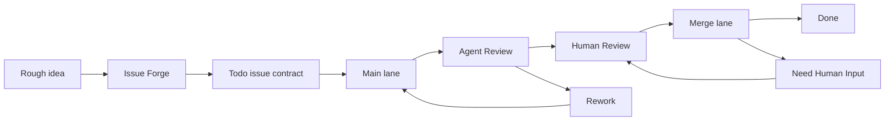

# Local Design Evidence: shea-symphony

Source path: /Volumes/Bohemialive/GitHub/shea-symphony
Read method: local-folder
Local paths discovered: 494
Snapshot files written: 59

## Intake Status

- Local source folder was read through bounded `od tools connectors local-design-context` intake.

## README (README.md)

```md
# Shea Symphony

Shea Symphony is a team workflow system for supervised AI-native engineering.

It helps a human operator turn rough engineering intent into issue contracts,
run implementation agents in isolated workspaces, request independent agent
review, preserve audit evidence, and land approved pull requests through a
guarded merge lane.

It is inspired by OpenAI Symphony, but the focus here is not just launching an
agent. The focus is the whole team loop around the agent:

- what work is safe to start;
- who or what currently owns it;
- where the implementation happened;
- which evidence proves it is ready;
- when a human must decide;
- how the merge should be repaired, retried, or stopped.

Current maturity: **supervised team-workflow dogfood**. Shea Symphony can run
bounded Main, Review, and Merge lane ticks against a live tracker. It is moving
toward all-lane autopilot, but write-mode automation is still deliberately
observable, bounded, and operator-led.

## The Short Version

Modern coding agents are good at making changes. Teams need more than that.

A real team needs a way to say:

- this issue is clear enough to dispatch;
- this agent is allowed to work on it;
- this work happened in the right branch and worktree;
- this PR was independently reviewed;
- this human approval was recorded;
- this merge failure is mechanical, semantic, or blocked;
- this run can be resumed without guessing.

Shea Symphony turns those questions into a workflow.



The tracker stays the shared source of truth. Local artifacts, worktrees, logs,
and session records exist to make the tracker state explainable and recoverable,
not to replace it.

## How People Use It

Shea Symphony is designed around a human operator, not a hidden daemon.

The operator can ask:

1. What is ready to work on?
2. What is blocked or ambiguous?
3. Which lane should run next?
4. Did the agent leave enough evidence?
5. Is this safe to approve, repair, or merge?

The system answers through a few surfaces:

- **Issue Forge** shapes rough work into executable issues.
- **Main lane** implements 
...
```

## Source Evidence Inventory

### Product docs and manifests

Use these to understand product purpose, dependency stack, scripts, and public naming.

- docs/bootstrap/README.md -> `context/local-code/shea-symphony/files/docs/bootstrap/README.md` (source)
- docs/bootstrap/references/openai-symphony/elixir/README.md -> `context/local-code/shea-symphony/files/docs/bootstrap/references/openai-symphony/elixir/README.md` (source)
- docs/bootstrap/references/openai-symphony/README.md -> `context/local-code/shea-symphony/files/docs/bootstrap/references/openai-symphony/README.md` (source)
- examples/README.md -> `context/local-code/shea-symphony/files/examples/README.md` (source)
- skills/shea-symphony/README.md -> `context/local-code/shea-symphony/files/skills/shea-symphony/README.md` (source)
- web/README.md -> `context/local-code/shea-symphony/files/web/README.md` (source)
- workflows/README.md -> `context/local-code/shea-symphony/files/workflows/README.md` (source)
- web/package.json -> `context/local-code/shea-symphony/files/web/package.json` (source)

### Brand assets and icons

Preserve source build/runtime paths: files under `build/` should be copied back into root `build/` with their original filenames, while non-build logos, avatars, or wordmarks can be copied into `assets/`. Reflect the preserved files in `preview/brand-assets.html`.

- web/build/favicon.svg -> `context/local-code/shea-symphony/files/web/build/favicon.svg` (source)

### Theme, tokens, and styling

Extract concrete color, typography, spacing, radius, shadow, and theme-variable values from these files.

- web/src/app.css -> `context/local-code/shea-symphony/files/web/src/app.css` (source)
- web/.svelte-kit/output/prerendered/dependencies/_app/env.js -> `context/local-code/shea-symphony/files/web/.svelte-kit/output/prerendered/dependencies/_app/env.js` (source)
- docs/bootstrap/references/openai-symphony/elixir/priv/static/dashboard.css -> `context/local-code/shea-symphony/files/docs/bootstrap/references/openai-symphony/elixir/priv/static/dashboard.css` (source)

### App shell and navigation

Use these to recreate the product frame, navigation density, sidebars, window chrome, and layout rhythm.

- web/.svelte-kit/output/server/entries/pages/_layout.js -> `context/local-code/shea-symphony/files/web/.svelte-kit/output/server/entries/pages/_layout.js` (source)
- web/src/routes/+layout.js -> `context/local-code/shea-symphony/files/web/src/routes/layout.js` (source)

### Reusable components

Use these to derive buttons, inputs, cards, dialogs, avatars, selectors, menus, and feedback states.

- web/.svelte-kit/output/server/chunks/LaneCard.js -> `context/local-code/shea-symphony/files/web/.svelte-kit/output/server/chunks/LaneCard.js` (source)

### Other design evidence

Inspect these only after the primary design evidence above has been used.

- .codex/skills/shea-symphony-doctor/SKILL.md -> `context/local-code/shea-symphony/files/.codex/skills/shea-symphony-doctor/SKILL.md` (source)
- .codex/skills/shea-symphony-human-review/SKILL.md -> `context/local-code/shea-symphony/files/.codex/skills/shea-symphony-human-review/SKILL.md` (source)
- .codex/skills/shea-symphony-issue-forge-dream/SKILL.md -> `context/local-code/shea-symphony/files/.codex/skills/shea-symphony-issue-forge-dream/SKILL.md` (source)
- .codex/skills/shea-symphony-issue-forge-reflect/SKILL.md -> `context/local-code/shea-symphony/files/.codex/skills/shea-symphony-issue-forge-reflect/SKILL.md` (source)
- .codex/skills/shea-symphony-issue-forge/SKILL.md -> `context/local-code/shea-symphony/files/.codex/skills/shea-symphony-issue-forge/SKILL.md` (source)
- .codex/skills/shea-symphony-manual-main/SKILL.md -> `context/local-code/shea-symphony/files/.codex/skills/shea-symphony-manual-main/SKILL.md` (source)
- .codex/skills/shea-symphony-manual-merge/SKILL.md -> `context/local-code/shea-symphony/files/.codex/skills/shea-symphony-manual-merge/SKILL.md` (source)
- .codex/skills/shea-symphony-manual-review/SKILL.md -> `context/local-code/shea-symphony/files/.codex/skills/shea-symphony-manual-review/SKILL.md` (source)
- docs/artifact-storage-policy.md -> `context/local-code/shea-symphony/files/docs/artifact-storage-policy.md` (source)
- docs/bootstrap-parity-audit.md -> `context/local-code/shea-symphony/files/docs/bootstrap-parity-audit.md` (source)
- docs/bootstrap/ISSUE_QUALITY_GATE_TEMPLATE.md -> `context/local-code/shea-symphony/files/docs/bootstrap/ISSUE_QUALITY_GATE_TEMPLATE.md` (source)
- docs/bootstrap/OFFICIAL_REFERENCE_INDEX.md -> `context/local-code/shea-symphony/files/docs/bootstrap/OFFICIAL_REFERENCE_INDEX.md` (source)
- docs/bootstrap/references/openai-symphony/.codex/skills/commit/SKILL.md -> `context/local-code/shea-symphony/files/docs/bootstrap/references/openai-symphony/.codex/skills/commit/SKILL.md` (source)
- docs/bootstrap/references/openai-symphony/.codex/skills/debug/SKILL.md -> `context/local-code/shea-symphony/files/docs/bootstrap/references/openai-symphony/.codex/skills/debug/SKILL.md` (source)
- docs/bootstrap/references/openai-symphony/.codex/skills/land/SKILL.md -> `context/local-code/shea-symphony/files/docs/bootstrap/references/openai-symphony/.codex/skills/land/SKILL.md` (source)
- docs/bootstrap/references/openai-symphony/.codex/skills/linear/SKILL.md -> `context/local-code/shea-symphony/files/docs/bootstrap/references/openai-symphony/.codex/skills/linear/SKILL.md` (source)
- docs/bootstrap/references/openai-symphony/.codex/skills/pull/SKILL.md -> `context/local-code/shea-symphony/files/docs/bootstrap/references/openai-symphony/.codex/skills/pull/SKILL.md` (source)
- docs/bootstrap/references/openai-symphony/.codex/skills/push/SKILL.md -> `context/local-code/shea-symphony/files/docs/bootstrap/references/openai-symphony/.codex/skills/push/SKILL.md` (source)
- docs/bootstrap/references/openai-symphony/.github/pull_request_template.md -> `context/local-code/shea-symphony/files/docs/bootstrap/references/openai-symphony/.github/pull_request_template.md` (source)
- docs/bootstrap/references/openai-symphony/elixir/AGENTS.md -> `context/local-code/shea-symphony/files/docs/bootstrap/references/openai-symphony/elixir/AGENTS.md` (source)
- docs/bootstrap/references/openai-symphony/elixir/docs/logging.md -> `context/local-code/shea-symphony/files/docs/bootstrap/references/openai-symphony/elixir/docs/logging.md` (source)
- docs/bootstrap/references/openai-symphony/elixir/docs/token_accounting.md -> `context/local-code/shea-symphony/files/docs/bootstrap/references/openai-symphony/elixir/docs/token_accounting.md` (source)
- docs/bootstrap/references/openai-symphony/elixir/WORKFLOW.md -> `context/local-code/shea-symphony/files/docs/bootstrap/references/openai-symphony/elixir/WORKFLOW.md` (source)
- docs/bootstrap/references/openai-symphony/SPEC.md -> `context/local-code/shea-symphony/files/docs/bootstrap/references/openai-symphony/SPEC.md` (source)
- docs/bootstrap/SHEA_SYMPHONY_SPEC.md -> `context/local-code/shea-symphony/files/docs/bootstrap/SHEA_SYMPHONY_SPEC.md` (source)
- docs/bootstrap/SHEA_WORKFLOW.md -> `context/local-code/shea-symphony/files/docs/bootstrap/SHEA_WORKFLOW.md` (source)
- docs/bootstrap/TRACKER_GITHUB_PROJECT_V2.md -> `context/local-code/shea-symphony/files/docs/bootstrap/TRACKER_GITHUB_PROJECT_V2.md` (source)
- docs/cli-command-reference.md -> `context/local-code/shea-symphony/files/docs/cli-command-reference.md` (source)
- docs/codex-app-server-transport.md -> `context/local-code/shea-symphony/files/docs/codex-app-server-transport.md` (source)
- docs/dogfood-readiness.md -> `context/local-code/shea-symphony/files/docs/dogfood-readiness.md` (source)
- docs/dream-log/2026-05-18-01-issue-295-dream-skill-rehearsal/created-backlog.md -> `context/local-code/shea-symphony/files/docs/dream-log/2026-05-18-01-issue-295-dream-skill-rehearsal/created-backlog.md` (source)
- docs/dream-log/2026-05-18-01-issue-295-dream-skill-rehearsal/gemini-review.md -> `context/local-code/shea-symphony/files/docs/dream-log/2026-05-18-01-issue-295-dream-skill-rehearsal/gemini-review.md` (source)
- docs/dream-log/2026-05-18-01-issue-295-dream-skill-rehearsal/RUN.md -> `context/local-code/shea-symphony/files/docs/dream-log/2026-05-18-01-issue-295-dream-skill-rehearsal/RUN.md` (source)
- docs/dream-log/2026-05-18-01-issue-295-dream-skill-rehearsal/topic-runtime-recovery.md -> `context/local-code/shea-symphony/files/docs/dream-log/2026-05-18-01-issue-295-dream-skill-rehearsal/topic-runtime-recovery.md` (source)
- docs/dream-log/2026-05-18-02-dream-cli-skill-drift/created-backlog.md -> `context/local-code/shea-symphony/files/docs/dream-log/2026-05-18-02-dream-cli-skill-drift/created-backlog.md` (source)
- docs/dream-log/2026-05-18-02-dream-cli-skill-drift/gemini-review.md -> `context/local-code/shea-symphony/files/docs/dream-log/2026-05-18-02-dream-cli-skill-drift/gemini-review.md` (source)
- docs/dream-log/2026-05-18-02-dream-cli-skill-drift/RUN.md -> `context/local-code/shea-symphony/files/docs/dream-log/2026-05-18-02-dream-cli-skill-drift/RUN.md` (source)
- docs/dream-log/2026-05-18-02-dream-cli-skill-drift/topic-cli-skill-drift.md -> `context/local-code/shea-symphony/files/docs/dream-log/2026-05-18-02-dream-cli-skill-drift/topic-cli-skill-drift.md` (source)
- docs/dream-log/2026-05-19-01-openai-symphony-parity/created-backlog.md -> `context/local-code/shea-symphony/files/docs/dream-log/2026-05-19-01-openai-symphony-parity/created-backlog.md` (source)
- docs/dream-log/2026-05-19-01-openai-symphony-parity/gemini-review.md -> `context/local-code/shea-symphony/files/docs/dream-log/2026-05-19-01-openai-symphony-parity/gemini-review.md` (source)
- docs/dream-log/2026-05-19-01-openai-symphony-parity/RUN.md -> `context/local-code/shea-symphony/files/docs/dream-log/2026-05-19-01-openai-symphony-parity/RUN.md` (source)
- docs/dream-log/2026-05-19-01-openai-symphony-parity/topic-openai-symphony-parity.md -> `context/local-code/shea-symphony/files/docs/dream-log/2026-05-19-01-openai-symphony-parity/topic-openai-symphony-parity.md` (source)
- docs/dream-log/2026-05-19-02-worker-supervision-parity/created-backlog.md -> `context/local-code/shea-symphony/files/docs/dream-log/2026-05-19-02-worker-supervision-parity/created-backlog.md` (source)
- docs/dream-log/2026-05-19-02-worker-supervision-parity/gemini-review.md -> `context/local-code/shea-symphony/files/docs/dream-log/2026-05-19-02-worker-supervision-parity/gemini-review.md` (source)


## Files Inspected

- web/src/app.css -> `context/local-code/shea-symphony/files/web/src/app.css` (24713 bytes, local-folder)
- web/build/favicon.svg -> `context/local-code/shea-symphony/files/web/build/favicon.svg` (244 bytes, local-folder)
- docs/bootstrap/README.md -> `context/local-code/shea-symphony/files/docs/bootstrap/README.md` (1339 bytes, local-folder)
- docs/bootstrap/references/openai-symphony/elixir/README.md -> `context/local-code/shea-symphony/files/docs/bootstrap/references/openai-symphony/elixir/README.md` (8458 bytes, local-folder)
- docs/bootstrap/references/openai-symphony/README.md -> `context/local-code/shea-symphony/files/docs/bootstrap/references/openai-symphony/README.md` (1731 bytes, local-folder)
- examples/README.md -> `context/local-code/shea-symphony/files/examples/README.md` (5256 bytes, local-folder)
- skills/shea-symphony/README.md -> `context/local-code/shea-symphony/files/skills/shea-symphony/README.md` (3982 bytes, local-folder)
- web/README.md -> `context/local-code/shea-symphony/files/web/README.md` (1395 bytes, local-folder)
- workflows/README.md -> `context/local-code/shea-symphony/files/workflows/README.md` (5893 bytes, local-folder)
- web/.svelte-kit/output/prerendered/dependencies/_app/env.js -> `context/local-code/shea-symphony/files/web/.svelte-kit/output/prerendered/dependencies/_app/env.js` (19 bytes, local-folder)
- web/package.json -> `context/local-code/shea-symphony/files/web/package.json` (595 bytes, local-folder)
- web/.svelte-kit/output/server/chunks/LaneCard.js -> `context/local-code/shea-symphony/files/web/.svelte-kit/output/server/chunks/LaneCard.js` (983 bytes, local-folder)
- web/.svelte-kit/output/server/entries/pages/_layout.js -> `context/local-code/shea-symphony/files/web/.svelte-kit/output/server/entries/pages/_layout.js` (89 bytes, local-folder)
- web/src/routes/+layout.js -> `context/local-code/shea-symphony/files/web/src/routes/layout.js` (31 bytes, local-folder)
- .codex/skills/shea-symphony-doctor/SKILL.md -> `context/local-code/shea-symphony/files/.codex/skills/shea-symphony-doctor/SKILL.md` (3751 bytes, local-folder)
- .codex/skills/shea-symphony-human-review/SKILL.md -> `context/local-code/shea-symphony/files/.codex/skills/shea-symphony-human-review/SKILL.md` (15855 bytes, local-folder)
- .codex/skills/shea-symphony-issue-forge-dream/SKILL.md -> `context/local-code/shea-symphony/files/.codex/skills/shea-symphony-issue-forge-dream/SKILL.md` (10562 bytes, local-folder)
- .codex/skills/shea-symphony-issue-forge-reflect/SKILL.md -> `context/local-code/shea-symphony/files/.codex/skills/shea-symphony-issue-forge-reflect/SKILL.md` (7202 bytes, local-folder)
- .codex/skills/shea-symphony-issue-forge/SKILL.md -> `context/local-code/shea-symphony/files/.codex/skills/shea-symphony-issue-forge/SKILL.md` (7051 bytes, local-folder)
- .codex/skills/shea-symphony-manual-main/SKILL.md -> `context/local-code/shea-symphony/files/.codex/skills/shea-symphony-manual-main/SKILL.md` (8924 bytes, local-folder)
- .codex/skills/shea-symphony-manual-merge/SKILL.md -> `context/local-code/shea-symphony/files/.codex/skills/shea-symphony-manual-merge/SKILL.md` (8273 bytes, local-folder)
- .codex/skills/shea-symphony-manual-review/SKILL.md -> `context/local-code/shea-symphony/files/.codex/skills/shea-symphony-manual-review/SKILL.md` (7026 bytes, local-folder)
- docs/artifact-storage-policy.md -> `context/local-code/shea-symphony/files/docs/artifact-storage-policy.md` (5542 bytes, local-folder)
- docs/bootstrap-parity-audit.md -> `context/local-code/shea-symphony/files/docs/bootstrap-parity-audit.md` (7729 bytes, local-folder)
- docs/bootstrap/ISSUE_QUALITY_GATE_TEMPLATE.md -> `context/local-code/shea-symphony/files/docs/bootstrap/ISSUE_QUALITY_GATE_TEMPLATE.md` (4452 bytes, local-folder)
- docs/bootstrap/OFFICIAL_REFERENCE_INDEX.md -> `context/local-code/shea-symphony/files/docs/bootstrap/OFFICIAL_REFERENCE_INDEX.md` (2720 bytes, local-folder)
- docs/bootstrap/references/openai-symphony/.codex/skills/commit/SKILL.md -> `context/local-code/shea-symphony/files/docs/bootstrap/references/openai-symphony/.codex/skills/commit/SKILL.md` (2480 bytes, local-folder)
- docs/bootstrap/references/openai-symphony/.codex/skills/debug/SKILL.md -> `context/local-code/shea-symphony/files/docs/bootstrap/references/openai-symphony/.codex/skills/debug/SKILL.md` (4314 bytes, local-folder)
- docs/bootstrap/references/openai-symphony/.codex/skills/land/SKILL.md -> `context/local-code/shea-symphony/files/docs/bootstrap/references/openai-symphony/.codex/skills/land/SKILL.md` (10064 bytes, local-folder)
- docs/bootstrap/references/openai-symphony/.codex/skills/linear/SKILL.md -> `context/local-code/shea-symphony/files/docs/bootstrap/references/openai-symphony/.codex/skills/linear/SKILL.md` (6838 bytes, local-folder)
- docs/bootstrap/references/openai-symphony/.codex/skills/pull/SKILL.md -> `context/local-code/shea-symphony/files/docs/bootstrap/references/openai-symphony/.codex/skills/pull/SKILL.md` (4685 bytes, local-folder)
- docs/bootstrap/references/openai-symphony/.codex/skills/push/SKILL.md -> `context/local-code/shea-symphony/files/docs/bootstrap/references/openai-symphony/.codex/skills/push/SKILL.md` (4393 bytes, local-folder)
- docs/bootstrap/references/openai-symphony/.github/pull_request_template.md -> `context/local-code/shea-symphony/files/docs/bootstrap/references/openai-symphony/.github/pull_request_template.md` (537 bytes, local-folder)
- docs/bootstrap/references/openai-symphony/elixir/AGENTS.md -> `context/local-code/shea-symphony/files/docs/bootstrap/references/openai-symphony/elixir/AGENTS.md` (2190 bytes, local-folder)
- docs/bootstrap/references/openai-symphony/elixir/docs/logging.md -> `context/local-code/shea-symphony/files/docs/bootstrap/references/openai-symphony/elixir/docs/logging.md` (1607 bytes, local-folder)
- docs/bootstrap/references/openai-symphony/elixir/docs/token_accounting.md -> `context/local-code/shea-symphony/files/docs/bootstrap/references/openai-symphony/elixir/docs/token_accounting.md` (9172 bytes, local-folder)
- docs/bootstrap/references/openai-symphony/elixir/priv/static/dashboard.css -> `context/local-code/shea-symphony/files/docs/bootstrap/references/openai-symphony/elixir/priv/static/dashboard.css` (8078 bytes, local-folder)
- docs/bootstrap/references/openai-symphony/elixir/WORKFLOW.md -> `context/local-code/shea-symphony/files/docs/bootstrap/references/openai-symphony/elixir/WORKFLOW.md` (19006 bytes, local-folder)
- docs/bootstrap/references/openai-symphony/SPEC.md -> `context/local-code/shea-symphony/files/docs/bootstrap/references/openai-symphony/SPEC.md` (80204 bytes, local-folder)
- docs/bootstrap/SHEA_SYMPHONY_SPEC.md -> `context/local-code/shea-symphony/files/docs/bootstrap/SHEA_SYMPHONY_SPEC.md` (12309 bytes, local-folder)
- docs/bootstrap/SHEA_WORKFLOW.md -> `context/local-code/shea-symphony/files/docs/bootstrap/SHEA_WORKFLOW.md` (8574 bytes, local-folder)
- docs/bootstrap/TRACKER_GITHUB_PROJECT_V2.md -> `context/local-code/shea-symphony/files/docs/bootstrap/TRACKER_GITHUB_PROJECT_V2.md` (6512 bytes, local-folder)
- docs/cli-command-reference.md -> `context/local-code/shea-symphony/files/docs/cli-command-reference.md` (46126 bytes, local-folder)
- docs/codex-app-server-transport.md -> `context/local-code/shea-symphony/files/docs/codex-app-server-transport.md` (2656 bytes, local-folder)
- docs/dogfood-readiness.md -> `context/local-code/shea-symphony/files/docs/dogfood-readiness.md` (48116 bytes, local-folder)
- docs/dream-log/2026-05-18-01-issue-295-dream-skill-rehearsal/created-backlog.md -> `context/local-code/shea-symphony/files/docs/dream-log/2026-05-18-01-issue-295-dream-skill-rehearsal/created-backlog.md` (1131 bytes, local-folder)
- docs/dream-log/2026-05-18-01-issue-295-dream-skill-rehearsal/gemini-review.md -> `context/local-code/shea-symphony/files/docs/dream-log/2026-05-18-01-issue-295-dream-skill-rehearsal/gemini-review.md` (958 bytes, local-folder)
- docs/dream-log/2026-05-18-01-issue-295-dream-skill-rehearsal/RUN.md -> `context/local-code/shea-symphony/files/docs/dream-log/2026-05-18-01-issue-295-dream-skill-rehearsal/RUN.md` (2851 bytes, local-folder)
- docs/dream-log/2026-05-18-01-issue-295-dream-skill-rehearsal/topic-runtime-recovery.md -> `context/local-code/shea-symphony/files/docs/dream-log/2026-05-18-01-issue-295-dream-skill-rehearsal/topic-runtime-recovery.md` (2499 bytes, local-folder)
- docs/dream-log/2026-05-18-02-dream-cli-skill-drift/created-backlog.md -> `context/local-code/shea-symphony/files/docs/dream-log/2026-05-18-02-dream-cli-skill-drift/created-backlog.md` (847 bytes, local-folder)
- docs/dream-log/2026-05-18-02-dream-cli-skill-drift/gemini-review.md -> `context/local-code/shea-symphony/files/docs/dream-log/2026-05-18-02-dream-cli-skill-drift/gemini-review.md` (1156 bytes, local-folder)
- docs/dream-log/2026-05-18-02-dream-cli-skill-drift/RUN.md -> `context/local-code/shea-symphony/files/docs/dream-log/2026-05-18-02-dream-cli-skill-drift/RUN.md` (5116 bytes, local-folder)
- docs/dream-log/2026-05-18-02-dream-cli-skill-drift/topic-cli-skill-drift.md -> `context/local-code/shea-symphony/files/docs/dream-log/2026-05-18-02-dream-cli-skill-drift/topic-cli-skill-drift.md` (2987 bytes, local-folder)
- docs/dream-log/2026-05-19-01-openai-symphony-parity/created-backlog.md -> `context/local-code/shea-symphony/files/docs/dream-log/2026-05-19-01-openai-symphony-parity/created-backlog.md` (1220 bytes, local-folder)
- docs/dream-log/2026-05-19-01-openai-symphony-parity/gemini-review.md -> `context/local-code/shea-symphony/files/docs/dream-log/2026-05-19-01-openai-symphony-parity/gemini-review.md` (1118 bytes, local-folder)
- docs/dream-log/2026-05-19-01-openai-symphony-parity/RUN.md -> `context/local-code/shea-symphony/files/docs/dream-log/2026-05-19-01-openai-symphony-parity/RUN.md` (5297 bytes, local-folder)
- docs/dream-log/2026-05-19-01-openai-symphony-parity/topic-openai-symphony-parity.md -> `context/local-code/shea-symphony/files/docs/dream-log/2026-05-19-01-openai-symphony-parity/topic-openai-symphony-parity.md` (4307 bytes, local-folder)
- docs/dream-log/2026-05-19-02-worker-supervision-parity/created-backlog.md -> `context/local-code/shea-symphony/files/docs/dream-log/2026-05-19-02-worker-supervision-parity/created-backlog.md` (513 bytes, local-folder)
- docs/dream-log/2026-05-19-02-worker-supervision-parity/gemini-review.md -> `context/local-code/shea-symphony/files/docs/dream-log/2026-05-19-02-worker-supervision-parity/gemini-review.md` (1012 bytes, local-folder)

## Design-Relevant Excerpts

### web/src/app.css

```css
/* Shea Symphony cockpit tokens: dark graphite canvas, calm operator hierarchy,
 * restrained cyan / green / amber / red status color, and spacious control
 * surfaces for supervised local workflow operations. */

:root {
  --bg: #090d10;
  --surface: #11171b;
  --surface-warm: #182126;
  --fg: rgba(244, 247, 248, 0.94);
  --fg-2: #e9f2f0;
  --muted: rgba(201, 214, 217, 0.64);
  --meta: var(--muted);
  --border: rgba(155, 179, 184, 0.24);
  --border-soft: rgba(155, 179, 184, 0.14);
  --accent: #48d7df;
  --accent-on: #061014;
  --accent-hover: color-mix(in oklab, var(--accent), black 8%);
  --accent-active: color-mix(in oklab, var(--accent), black 14%);
  --success: #48d597;
  --warn: #e5b85f;
  --danger: #ef6b73;
  --font-display: "SF Pro Display", "Inter", "Helvetica Neue", Helvetica, Arial, sans-serif;
  --font-body: "SF Pro Text", "Inter", "Helvetica Neue", Helvetica, Arial, sans-serif;
  --font-mono: ui-monospace, "SF Mono", "JetBrains Mono", Menlo, Monaco, Consolas, monospace;
  --text-xs: 13px;
  --text-sm: 14px;
  --text-base: 16px;
  --text-lg: 19px;
  --text-xl: 24px;
  --text-2xl: 32px;
  --text-3xl: 45px;
  --text-4xl: 58px;
  --leading-body: 1.5;
  --leading-tight: 1.2;
  --tracking-display: -0.01em;
  --space-1: 4px;
  --space-2: 8px;
  --space-3: 12px;
  --space-4: 16px;
  --space-5: 20px;
  --space-6: 24px;
  --space-8: 32px;
  --space-12: 48px;
  --section-y-desktop: 64px;
  --section-y-tablet: 48px;
  --section-y-phone: 32px;
  --radius-sm: 4px;
  --radius-md: 8px;
  --radius-lg: 8px;
  --radius-pill: 9999px;
  --elev-flat: none;
  --elev-ring: 0 0 0 1px var(--border);
  --elev-raised: 0 1px 0 rgba(255, 255, 255, 0.04) inset, 0 24px 70px rgba(0, 0, 0, 0.28);
  --focus-ring: 0 0 0 3px color-mix(in oklab, var(--accent), transparent 70%);
  --motion-fast: 150ms;
  --motion-base: 200ms;
  --ease-standard: cubic-bezier(0.25, 0.46, 0.45, 0.94);
  --container-max: 1440px;
  --container-gutter-desktop: 40px;
  --container-gutter-tablet: 24px;
  --container-gutter-phone: 16px;
}

* {
  box-sizing: border-box;
}

html {
  min-width: 320px;
  background: var(--bg);
  color: var(--fg);
  font-family: var(--font-body);
  letter-spacing: var(--tracking-display);
}

body {
  min-height: 100vh;
  margin: 0;
  background:
    radial-gradient(circle at 22% -10%, rgba(72, 215, 223, 0.1), transparent 34%),
    linear-gradient(135deg, #090d10 0%, #0d1216 48%, #
...
```

### web/build/favicon.svg

```
<svg xmlns="http://www.w3.org/2000/svg" viewBox="0 0 64 64">
  <rect width="64" height="64" rx="16" fill="#1E3932"/>
  <circle cx="32" cy="32" r="22" fill="#00754A"/>
  <path d="M20 39h24v4H20zm4-18h16l4 8-4 8H24l-4-8z" fill="#f2f0eb"/>
</svg>

```

### docs/bootstrap/README.md

```
# Shea Symphony Bootstrap

This directory contains the bootstrap materials for building Shea Symphony, a
private-first team harness for orchestrating coding agents.

## Source Boundaries

- Official OpenAI Symphony material lives under
  `docs/bootstrap/references/openai-symphony` as a Git submodule.
- Do not edit the official submodule directly.
- Shea Symphony-specific interpretation and implementation decisions live in this
  directory.
- Future implementation code should live outside `docs/bootstrap`.

## Required Reading Order

1. `docs/bootstrap/references/openai-symphony/SPEC.md`
2. `docs/bootstrap/references/openai-symphony/elixir/WORKFLOW.md`
3. `docs/bootstrap/references/openai-symphony/elixir/README.md`
4. `docs/bootstrap/OFFICIAL_REFERENCE_INDEX.md`
5. `docs/bootstrap/SHEA_SYMPHONY_SPEC.md`
6. `docs/bootstrap/TRACKER_GITHUB_PROJECT_V2.md`
7. `docs/bootstrap/SHEA_WORKFLOW.md`
8. `docs/bootstrap/ISSUE_QUALITY_GATE_TEMPLATE.md`

## Implementation Posture

Shea Symphony should be built from the official Symphony specification, not by
blindly porting the Elixir reference implementation. The Elixir code is a
reference for behavior, structure, and operational tradeoffs.

The first implementation target is a Rust CLI with GitHub Project v2 as the
first tracker adapter and Linear kept as a required future adapter.

```

### docs/bootstrap/references/openai-symphony/elixir/README.md

```
# Symphony Elixir

This directory contains the current Elixir/OTP implementation of Symphony, based on
[`SPEC.md`](../SPEC.md) at the repository root.

> [!WARNING]
> Symphony Elixir is prototype software intended for evaluation only and is presented as-is.
> We recommend implementing your own hardened version based on `SPEC.md`.

## Screenshot


## How it works

1. Polls Linear for candidate work
2. Creates a workspace per issue
3. Launches Codex in [App Server mode](https://developers.openai.com/codex/app-server/) inside the
   workspace
4. Sends a workflow prompt to Codex
5. Keeps Codex working on the issue until the work is done

During app-server sessions, Symphony also serves a client-side `linear_graphql` tool so that repo
skills can make raw Linear GraphQL calls.

If a claimed issue moves to a terminal state (`Done`, `Closed`, `Cancelled`, or `Duplicate`),
Symphony stops the active agent for that issue and cleans up matching workspaces.

## How to use it

1. Make sure your codebase is set up to work well with agents: see
   [Harness engineering](https://openai.com/index/harness-engineering/).
2. Get a new personal token in Linear via Settings → Security & access → Personal API keys, and
   set it as the `LINEAR_API_KEY` environment variable.
3. Copy this directory's `WORKFLOW.md` to your repo.
4. Optionally copy the `commit`, `push`, `pull`, `land`, and `linear` skills to your repo.
   - The `linear` skill expects Symphony's `linear_graphql` app-server tool for raw Linear GraphQL
     operations such as comment editing or upload flows.
5. Customize the copied `WORKFLOW.md` file for your project.
   - To get your project's slug, right-click the project and copy its URL. The slug is part of the
     URL.
   - When creating a workflow based on this repo, note that it depends on non-standard Linear
     issue statuses: "Rework", "Human Review", and "Merging". You can customize them in
     Team Settings → Workflow in Linear.
6. Follow the instructions below to install the required runtime dependencies and start the service.

## Prerequisites

We recommend using [mise](https://mise.jdx.dev/) to manage Elixir/Erlang versions.

```bash
mise install
mise exec -- elixir --version
```

## Run

```bash
git clone https://github.com/openai/symphony
cd symphony/elixir
mise trust
mise install
mis
...
```

### docs/bootstrap/references/openai-symphony/README.md

```
# Symphony

Symphony turns project work into isolated, autonomous implementation runs, allowing teams to manage
work instead of supervising coding agents.

[](.github/media/symphony-demo.mp4)

_In this [demo video](.github/media/symphony-demo.mp4), Symphony monitors a Linear board for work and spawns agents to handle the tasks. The agents complete the tasks and provide proof of work: CI status, PR review feedback, complexity analysis, and walkthrough videos. When accepted, the agents land the PR safely. Engineers do not need to supervise Codex; they can manage the work at a higher level._

> [!WARNING]
> Symphony is a low-key engineering preview for testing in trusted environments.

## Running Symphony

### Requirements

Symphony works best in codebases that have adopted
[harness engineering](https://openai.com/index/harness-engineering/). Symphony is the next step --
moving from managing coding agents to managing work that needs to get done.

### Option 1. Make your own

Tell your favorite coding agent to build Symphony in a programming language of your choice:

> Implement Symphony according to the following spec:
> https://github.com/openai/symphony/blob/main/SPEC.md

### Option 2. Use our experimental reference implementation

Check out [elixir/README.md](elixir/README.md) for instructions on how to set up your environment
and run the Elixir-based Symphony implementation. You can also ask your favorite coding agent to
help with the setup:

> Set up Symphony for my repository based on
> https://github.com/openai/symphony/blob/main/elixir/README.md

---

## License

This project is licensed under the [Apache License 2.0](LICENSE).

```

### examples/README.md

```
# Shea Symphony Example Workflows

This directory contains fixture, demo, and compatibility workflows for
rehearsing Shea Symphony behavior. Most examples are fixture-backed and
credential-free.

The normal repo dogfood workflow is not in this directory. Use
`workflows/shea-symphony.md` for live Project #9 operator runs. The live GitHub
Project examples remain as compatibility/reference material for debugging older
commands and testing specific lanes.

## Fixture Dispatch

| Workflow | Purpose | Safe commands |
| --- | --- | --- |
| `dry-run-workflow.md` | Main credential-free dispatch and main loop fixture backed by `fixtures/dry-run-issues.json`. | `cargo run -- plan examples/dry-run-workflow.md`; `cargo run -- main loop examples/dry-run-workflow.md --max-iterations 1 --dry-run` |
| `source-alignment-workflow.md` | Source-alignment gate fixture with one valid and one broken issue. | `cargo run -- plan examples/source-alignment-workflow.md`; `cargo run -- forge validate --workflow examples/source-alignment-workflow.md '#1'` |
| `usage-limit-workflow.md` | Fixture backend path that exercises usage-limit pause handling. | `cargo run -- main loop examples/usage-limit-workflow.md --max-iterations 1 --write` |
| `git-identity-workflow.md` | Workspace-local git identity application fixture. | `cargo run -- main once examples/git-identity-workflow.md` |

Fixture workflows may use `--write` when the tracker is fixture-backed or
memory-backed. They do not mutate live GitHub Project v2 state.

## Tracker Adapters

| Workflow | Purpose | Notes |
| --- | --- | --- |
| `linear-fixture-workflow.md` | Linear adapter fixture backed by `fixtures/linear-issues.json`. | Credential-free; does not prove live Linear readiness. |
| `github-project-workflow.md` | Legacy live GitHub Project v2 template for Project #9. | Compatibility/reference workflow; prefer `workflows/shea-symphony.md` for normal operator runs. |
| `github-project-gemini-review-workflow.md` | Legacy live GitHub Project v2 Review Agent template for Project #9. | Compatibility/reference workflow; `workflows/shea-symphony.md` carries the normal review config. |

## Agent Backend Fixtures

| Workflow | Purpose | Notes |
| --- | --- | --- |
| `codex-subprocess-workflow.md` | Conservative Codex subprocess backend fixture. | Runs the configured command in the prepared workspace. |
| `claude-subprocess-workflow.md` | Co
...
```

### skills/shea-symphony/README.md

```
# Shea Symphony Skill Suite

Release: `2026.05.23`

This directory contains the repo-owned Shea Symphony skills used by local Codex
and Gemini operator sessions. The suite is intentionally versioned in the repo
so skill behavior can be reviewed with workflow docs, prompts, and CLI changes.

## Install Or Preview

Preview the detected local targets without writing:

```bash
node scripts/install-shea-symphony-skills.js --dry-run
```

Install or update after an interactive confirmation:

```bash
node scripts/install-shea-symphony-skills.js
```

Install non-interactively only after choosing explicit targets:

```bash
node scripts/install-shea-symphony-skills.js \
  --codex-dir "$HOME/.codex/skills" \
  --gemini-dir "$HOME/.gemini/local-skills" \
  --yes
```

Validate active local copies against the repo-owned suite:

```bash
node scripts/install-shea-symphony-skills.js --validate
```

Before installing or starting a skill-dependent session, inspect readiness
without writing local skill roots:

```bash
cargo run -- skills status workflows/shea-symphony.md
cargo run -- skills status workflows/shea-symphony.md --json
cargo run -- skills status workflows/shea-symphony.md --session-skills "shea-symphony-manual-main,shea-symphony-doctor"
```

`skills status` treats this suite as the expected source, then compares Codex
and Gemini local installs, rendered metadata, symlink or alias shape, and
optional current-session skill visibility. Source suite discovery is
`--suite-path`, `SHEA_SYMPHONY_SKILL_SUITE`, current repo
`skills/shea-symphony/suite`, then installed-only mode. Missing session input is
reported as `unknown`, not as a failure. Gemini is optional unless the operator
passes `--require-gemini` or otherwise configures a Gemini skill root.

The installer detects:

- Codex target from `CODEX_HOME/skills`, then `$HOME/.codex/skills`.
- Gemini target from `GEMINI_HOME/local-skills`, then `$HOME/.gemini/local-skills`.

Use `--skip-codex`, `--skip-gemini`, `--codex-dir`, or `--gemini-dir` to make
the target set explicit. Normal install mode shows every target and requires
operator confirmation before writing.

## Packaged Skills

- `shea-symphony-issue-forge`
- `shea-symphony-issue-forge-reflect`
- `shea-symphony-issue-forge-dream`
- `shea-symphony-manual-main`
- `shea-symphony-manual-review`
- `shea-symphony-human-review`
- `shea-symphony-manual-merge`
- `shea-symphon
...
```

### web/README.md

```
# Shea Symphony Operator Desk

This web app was migrated from the OpenDesign prototype at:

`/Users/chuntengxiao/Library/Application Support/Open Design/namespaces/release-stable/data/projects/65ae20da-8bf8-4e78-b685-98b0fd5de2f6/`

It is a SvelteKit static build with a local Node server that exposes a small
loopback-only API for Shea Symphony CLI commands.

## Run

```sh
cd web
npm run build
npm run serve
```

Open `http://localhost:5173/`.

For an offline smoke/demo mode that does not call GitHub or mutate tracker
state:

```sh
cd web
npm run build
npm run serve:fixture
```

## Live CLI Bridge

The server reads `SHEA_WORKFLOW` when set, otherwise it uses:

`workflows/shea-symphony.md`

Supported UI actions are intentionally allowlisted in `server.mjs`:

- `autopilot plan --json`
- `doctor --json`
- `review status --json`
- `skills status --json`
- `project issue --json`
- `project inspect`
- `gate`
- `project set-state`
- `autopilot loop --once`
- `merge once`
- `project timeline-comment`

Write-mode actions require the UI write toggle; otherwise the server passes
dry-run flags where the CLI supports them.

`SHEA_WEB_FIXTURE=1` returns live-shaped sample data and fixture command output
through the same API routes. Use it for browser QA when GitHub/network access is
unavailable.

## Handoff Files

The OpenDesign reference notes and screenshot are preserved in `handoff/`.

```

### workflows/README.md

```
# Shea Symphony Workflows

`workflows/shea-symphony.md` is the canonical normal operator workflow index for
Shea Symphony self-dogfood. It owns shared tracker, artifact, workspace, review,
verification, and observability config, then points each lane at its own prompt
contract under `workflows/prompts/`.

Use it for live Project #9 operations:

```bash
cargo run -- autopilot plan workflows/shea-symphony.md
cargo run -- autopilot loop workflows/shea-symphony.md --max-iterations 1 --write
cargo run -- forge validate --workflow workflows/shea-symphony.md --status Todo --title "<title>" --body-file /private/tmp/issue.md
cargo run -- forge validate --workflow workflows/shea-symphony.md --issue '#123' --status Todo --title "<candidate title>" --body-file /private/tmp/candidate.md
cargo run -- forge create --workflow workflows/shea-symphony.md --status Todo --title "<title>" --body-file /private/tmp/issue.md --assignee Alive24 --write
cargo run -- main loop workflows/shea-symphony.md --max-iterations 1 --write
cargo run -- review loop workflows/shea-symphony.md --max-iterations 1 --write
cargo run -- merge once workflows/shea-symphony.md --write
cargo run -- main claim workflows/shea-symphony.md '#123' --worker "Codex Manual Main" --write
cargo run -- session start workflows/shea-symphony.md '#123' --lane main --run <RUN_ID> --write
cargo run -- session list workflows/shea-symphony.md
```

Normal all-lane dogfood starts with read-only `autopilot plan`, then uses
bounded foreground `autopilot loop --write`. `autopilot loop` is not a daemon,
background service, or app-server; it composes Main, Review, and Merge lane
ticks in order and returns control to the operator after the explicit iteration
budget. Use `main loop`, `review loop`, or `merge loop` directly for focused
debugging, break-glass recovery, or deliberately lane-specific dogfood.

Write-mode lane/control commands are safe to run from the canonical checkout on
`main` even when local `main` is only behind `origin/main`: before tracker
mutation, Shea Symphony fetches the configured upstream and performs a
canonical-only `git merge --ff-only`. Dry-runs report `would_ff_only` without
changing the checkout. Dirty, detached, non-`main`, missing-upstream, and
non-fast-forward cases still fail closed; issue worktrees and PR branches are
not refreshed by this path.

Main Agent execution defaults to the Codex app-ser
...
```

### web/.svelte-kit/output/prerendered/dependencies/_app/env.js

```js
export const env={}
```

### web/package.json

```json
{
  "name": "shea-symphony-operator-desk",
  "version": "0.1.0",
  "private": true,
  "type": "module",
  "scripts": {
    "dev": "vite --host 127.0.0.1",
    "build": "vite build",
    "preview": "vite preview --host 127.0.0.1",
    "serve": "node server.mjs",
    "serve:fixture": "SHEA_WEB_FIXTURE=1 node server.mjs",
    "operator": "npm run build && npm run serve",
    "test": "node --test"
  },
  "devDependencies": {
    "@sveltejs/adapter-static": "latest",
    "@sveltejs/kit": "latest",
    "@sveltejs/vite-plugin-svelte": "latest",
    "svelte": "latest",
    "vite": "latest"
  }
}

```

### web/.svelte-kit/output/server/chunks/LaneCard.js

```js
import { H as escape_html, V as attr, n as attr_class, r as bind_props, u as stringify } from "./dev.js";
//#region src/lib/LaneCard.svelte
function LaneCard($$renderer, $$props) {
	$$renderer.component(($$renderer) => {
		let lane = $$props["lane"];
		$$renderer.push(`<article${attr_class(`lane-card ${stringify(lane.posture)}`)}><div class="lane-card-head"><div><span class="mini-label">${escape_html(lane.posture)}</span> <h3>${escape_html(lane.name)}</h3></div> <a class="btn btn-ghost"${attr("href", lane.href)}>View lane</a></div> <div class="lane-metrics"${attr("aria-label", `${lane.name} worker summary`)}><div><strong>${escape_html(lane.active)}</strong> <span>active</span></div> <div><strong>${escape_html(lane.retrying)}</strong> <span>retrying</span></div> <div><strong>${escape_html(lane.blocked)}</strong> <span>blocked</span></div></div> <p>${escape_html(lane.latest)}</p></article>`);
		bind_props($$props, { lane });
	});
}
//#endregion
export { LaneCard as t };

```


## Package Files Materialized

- `source_examples/web/.svelte-kit/output/server/entries/pages/_layout.js`
- `source_examples/web/.svelte-kit/output/server/chunks/LaneCard.js`

## Next Design-System Work

- Use these local source paths and snapshots as evidence before writing `DESIGN.md`.
- Convert the inventory above into a Claude Design-style package: `README.md`, `SKILL.md`, `colors_and_type.css`, `preview/colors-*`, `preview/typography-specimens.html`, `preview/spacing-*`, `preview/components-*`, `preview/brand-assets.html`, `ui_kits/app/`, and preserved `assets/`, `build/`, or `fonts/` when evidence exists.
- `ui_kits/app/index.html` must be a browser-reviewable component entry: load `../../colors_and_type.css`, load or import at least three files from `ui_kits/app/components/`, and mount the composed UI through ReactDOM/Babel or compiled browser-ready JavaScript. Do not duplicate a static HTML mock when modular component files exist.
- `ui_kits/app/components/App.jsx` (or equivalent app shell) must compose source-backed role components such as Sidebar, AssistantsList, ChatArea, InputBar, and MessageBubble, not merely list their filenames.
- Claude-style UI-kit entry skeleton for direct JSX kits:
  - `<script src="https://unpkg.com/react@18.3.1/umd/react.development.js"></script>`
  - `<script src="https://unpkg.com/react-dom@18.3.1/umd/react-dom.development.js"></script>`
  - `<script src="https://unpkg.com/@babel/standalone@7.29.0/babel.min.js"></script>`
  - `<link rel="stylesheet" href="../../colors_and_type.css">`
  - `<div id="root"></div>`
  - Load role components from `components/*.jsx` with `<script type="text/babel" src="components/ComponentName.jsx"></script>`.
  - Mount with `const { App } = window; const root = ReactDOM.createRoot(document.getElementById("root")); root.render(<App />);`.
- Preserve at least three high-signal source examples outside `context/` under `source_examples/` when reusable component snapshots exist, so future agents can compare generated components against original source structure.
- When a captured asset path begins with `build/`, copy the snapshot back into a root `build/` path with its original filename, such as `context/.../files/build/icon.png` -> `build/icon.png`. Do not satisfy build/runtime icon evidence by only renaming those files into `assets/`.
- Make `preview/brand-assets.html` visibly load preserved asset files from `assets/` or `build/`; do not redraw captured logos/icons as inline placeholders.
- Extract concrete colors, typography, spacing, radius, component behavior, assets, and product tone only when supported by inspected files.
- If evidence is missing or ambiguous, mark that uncertainty instead of inventing tokens.
