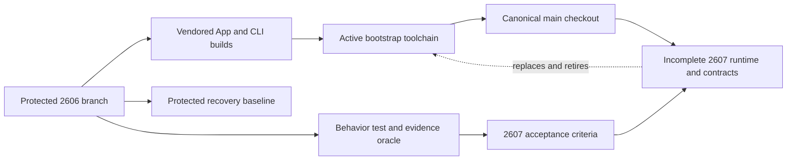

# Protected 2606 bootstrap runtime

## Why this runtime still matters

The protected 2606 branch preserves the complete end-to-end Shea Symphony workflow demonstrated in `README.md`: issue-contract validation, Main, independent Review, Human Review, Merge, Doctor, recovery, evidence, and tracker interaction. During 2607 development it is not merely historical reference or an emergency fallback. App and CLI binaries built from that protected branch are vendored as the **active bootstrap and orchestration toolchain** used to operate on the current canonical `main` checkout while the new Temporal product runtime is incomplete.

This is a self-hosting arrangement, not the 2607 target architecture. Recent history makes the operational intent visible: `a1f635d` vendored repaired 2606 runtime binaries, and `66a298c` rebuilt the vendored App with the production protocol. The excluded binary/runtime paths themselves are outside this wiki's inspection scope.

## Current topology

The diagram separates the source of today's complete operational toolchain from the checkout it operates on and from the future runtime that will retire it.

The checked-in Tauri source supports the engine/target split without by itself proving which binary payload is installed. `app/src-tauri/src/workspace.rs` records separate `engine_root` and `target_root` values and lets launch `--workdir` select the target. `app/src-tauri/src/cli.rs` runs product commands in that target directory using, in order, an explicit configured CLI path, a Cargo runner rooted at the engine checkout, or an engine debug binary. It also resolves the canonical `main` worktree for the App's engine root. In the current self-hosting deployment, the protected-2606-built vendored App/CLI fill the complete engine/toolchain role and canonical main is the target under development. Current main's root Rust binary is a partial 2607 Temporal worker host, **not** the source of the complete product CLI.

## Three distinct roles

| Role | What 2606 provides | What it does not mean |
| --- | --- | --- |
| **Active development bootstrap** | The complete App/CLI orchestration used now to develop and operate against canonical main. | It is not proof that current main implements the same end-to-end workflow through Temporal. |
| **Protected recovery baseline** | A known working branch/runtime to recover self-hosting capability if current development or vendored builds fail. | It is not a second supported durable scheduler inside 2607. |
| **Behavior, test, and evidence acceptance oracle** | Proven lifecycle semantics, safety gates, deterministic tests, and operational evidence that define what the replacement must preserve. | Its implementation structure is not the target architecture and need not remain code-compatible. |

These roles connect current operations to the [operator workflow semantics](../workflows/operator-workflows.md), while the [2607 execution contracts](execution-contracts.md) define where those semantics must be re-expressed.

## Replacement boundary

2607 and later replace the 2606 runtime architecture and orchestration ownership; they do not keep using, embed, or wrap that overall implementation as a compatibility layer. The replacement targets include:

- Autoloop, tick/resume loops, and lane runners as durable orchestration;
- product CLI ownership of review, merge, Doctor mutation, tracker transition, and other workflow semantics;
- vendored-runtime assumptions in target repositories;
- legacy command/lane implementation as the product runtime;
- scattered tracker writes, App source-of-truth interpretation, and local files used as workflow authority.

Required behavior and safety semantics must instead be expressed through the new [Temporal authority model](authority-and-state.md): deterministic `IssueWorkflow` decisions, coarse typed Activities, Coordinator activation/reconciliation, narrow Tauri operator commands, SQLite read projections, and capability-checked operator actions. 2606 tests and operational evidence may define acceptance scenarios, but passing them by calling the old implementation would not satisfy the replacement.

The corrected **Draft** milestone sources permit deliberate reuse or extraction of bounded Rust DTOs, parsers, tracker/Git adapters, event normalization, helpers, and focused tests when ownership is reviewed, the component is protocol-independent or otherwise fits the new typed boundary, and focused coverage travels with it. Reuse is not the default migration strategy and must not preserve old lane/runtime ownership, hidden state authority, broad command APIs, or external effects inside deterministic Workflow code.

`RUNTIME-ROLE-MAPPING.md`, `CODE-OWNERSHIP-MAP.md`, T2607-04, `APP-CLI-SPLIT.md`, and T2607-08 therefore treat 2606 behavior, tests, protocols, and operational evidence as acceptance inputs—not reusable orchestration/runtime substrate. Any thin admin/debug entrypoint must be new 2607 code over new Temporal APIs; it may share bounded reviewed types or helpers, but must not retain, rewire, call, embed, or wrap the 2606 product commands or lane implementation.

## Retirement criteria

The active 2606 bootstrap can be retired only when current main supplies and verifies the complete replacement path. Live progress is tracked by the milestone `STATUS.md` and configured Project; this architecture page owns only the retirement contract. Workspace/install decisions remain with ADR 0005 plus T2607-07/T2607-08. At minimum:

1. Temporal and Coordinator start/reconcile executable issue episodes with one durable decision owner per issue.
2. Main, Rework, Review, Human Review validation, Merge, Doctor, tracker commits, and local work run through typed Activity and operator-action contracts rather than 2606 commands or lane loops.
3. Tauri uses narrow direct 2607 interfaces; normal product reads no longer shell out to the 2606 CLI, and Autoloop is no longer controlled as a child process.
4. SQLite supplies rebuildable dashboard projections while selected active detail comes from Temporal Query, without either layer acquiring tracker or lifecycle authority.
5. Tracker transitions and evidence commits are idempotent, readback-verified, and centralized; recovery and reconciliation preserve the safety semantics demonstrated by 2606.
6. Replacement tests and operational evidence cover the complete end-to-end workflow and failure/recovery paths against the acceptance oracle.
7. Installed-runtime and workspace configuration no longer depend on vendored App/CLI binaries in the target repository.
8. Legacy product CLI orchestration, Autoloop, vendored-runtime assumptions, and old implementation paths can be deleted without losing operator capability or recovery coverage.

Until all of these are evidenced, [Operations](../operations.md) must keep the bootstrap/runtime distinction explicit. Repository milestone documents are not evidence that a criterion is complete, and no live issue status should be inferred from them.

## Primary evidence

- `README.md` — 2606's demonstrated end-to-end workflow and explicit statement that its CLI is to be replaced by Temporal.
- `docs/milestones/2607-hardening/README.md` — **Draft** baseline, subtraction goals, and vendored-runtime removal.
- `WORKSPACE-CONFIG.md`, `SUBTRACTION-INVENTORY.md`, `APP-CLI-SPLIT.md`, and `implementation/T2607-08-deletion-performance-hardening.md` — all **Draft** target boundaries.
- `app/src-tauri/src/{main,workspace,cli,autoloop,read_surfaces,temporal_health}.rs` — current command selection, target workspace, legacy product operations, and bounded direct Temporal readiness.
- Git commits `a1f635d` and `66a298c` — vendored repaired 2606 runtime binaries and rebuilt vendored App.
