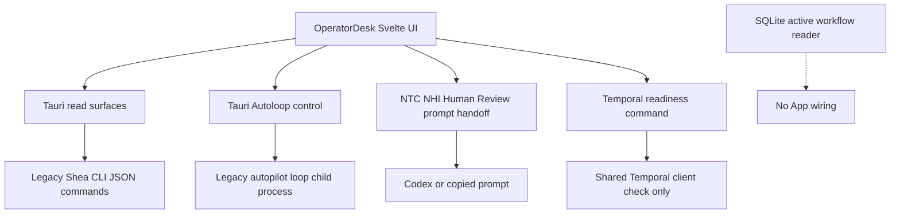
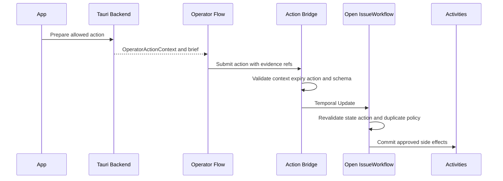

# Shea Symphony 2607 App and operator integration

> **Status: Draft target, partially prepared but not implemented end to end.** The T2607-07 package and its input documents are labelled **Draft**. Checked-in code still couples the operator App to 2606 CLI/Autoloop behavior; its direct Temporal integration is a read-only readiness probe. Repository plans do not establish live issue progress.

T2607-07 makes the Svelte/Tauri App the primary operator surface over Temporal and SQLite without making it another workflow engine. This contract depends on the [runtime authority model](authority-and-state.md): the tracker remains the external business fact, an active Temporal Workflow owns ordered execution decisions, and SQLite is a rebuildable local projection. It also depends on the validation and side-effect boundaries in [2607 execution contracts](execution-contracts.md).

## Current checked-in integration

`app/src/OperatorDesk.svelte` builds lane boards and a combined Human Todo for Need to Clarify (NTC), Need Human Input (NHI), and Human Review. It derives handoff prompts from the checked-in `.shea/prompts/**` templates through `app/src/lib/viewModel/handoffPrompt.ts`, then copies them or opens Codex. This is prompt routing, not an `OperatorActionContext` capability or structured action submission.

The Tauri backend remains coupled to the legacy product surface:

- `app/src-tauri/src/read_surfaces.rs` shells out to status, project, Doctor, review, Autopilot, and related CLI JSON commands; some readback also writes a local session-cache record. It is not the Draft SQLite dashboard reader.
- `autoloop.rs` starts and stops an `autopilot loop` child process, parses its output, and exposes lane state to the App. `cli.rs` selects an explicit CLI path, a Cargo runner, or a built debug binary for those calls.
- `workspace.rs` selects a target root and workflow path for the legacy commands. A launch `--workdir` wins over a stored profile; otherwise the stored profile wins over self-targeting. This implemented selection is narrower than the Draft configuration model described below.
- `temporal_health.rs` is the only direct 2607 Temporal seam. It captures the selected workspace, loads and validates that workflow configuration, and performs a bounded read-only service readiness check through `SymphonyTemporalClient`.
- The registered Tauri commands in `app/src-tauri/src/main.rs` contain no Workflow start/query/signal/update command and no `prepare_operator_action` or `submit_operator_action` bridge.

The local-state boundary is likewise preparatory. `src/symphony/local_state/reader.rs` provides crate-internal, read-only active `workflow_index` lookup/list operations. It does not expose the Draft `get_dashboard_snapshot`, tracker cache, activity progress, or artifact-index aggregation, and it is not wired to Tauri (`src/symphony/local_state/mod.rs`).

This is the checked-in App path: operational reads and loop control remain legacy-coupled, while Temporal is probed only for readiness.

## Draft T2607-07 target

The target removes normal product operation from CLI shell commands. The App calls a narrow Tauri allowlist that directly adapts the shared Symphony libraries and Temporal client; no independent local Symphony service is introduced. CLI remains an admin/development fallback for initialization, worker execution, self-checks, and thin Temporal debugging, but must not own Autopilot, lane policy, review, merge, Doctor mutation, or tracker transitions (`APP-CLI-SPLIT.md`; T2607-07).

### Reads: SQLite dashboard, Temporal selected detail

The top-level dashboard should read a cheap materialized snapshot from SQLite: active operational items, NTC/NHI/Human Review todos, concise PR and Workflow state, freshness, health, and artifact references. Rendering must not scan project history, read artifact bodies or worktrees eagerly, or trigger hidden refresh/mutation.

Selected issue detail has a different authority and cost boundary: query the active `IssueWorkflow` for current runtime state, combine it with SQLite artifact-index metadata, and lazy-load large evidence only after drill-down. If no active Workflow exists, detail may show projected tracker/recent-execution data with explicit freshness, but must not present that projection as current Temporal authority. This read split is an App-facing application of [authority and state](authority-and-state.md), not two competing sources of truth (`SNAPSHOT-AND-DASHBOARD.md`).

### Commands: direct, narrow Tauri responsibilities

The Draft command layer is responsible for bounded adapters such as dashboard reads, selected-detail Query, targeted Coordinator start/repair, explicit refresh, runtime/local-state health, and routed operator-action preparation. It may invoke Temporal start, Query, Signal, or Update through approved Symphony interfaces. Actual tracker/cache/artifact work belongs in Activities, and start/repair belongs behind the Coordinator rather than App-side scheduling.

The command layer must not expose a raw tracker client, raw SQLite writer, raw Temporal client, arbitrary Workflow mutation, direct agent run, or worktree mutation. In particular, the App must never directly:

- transition tracker lanes, link or merge PRs, or implement Human Review/NHI/NTC policy;
- edit or choose worktrees;
- run or resume an agent outside Temporal;
- perform Doctor repair outside Workflow capability and Activity policy;
- treat refresh/render as permission to mutate business state.

## Routed operator actions and capabilities

Human Review, NHI, NTC, and Doctor handoffs remain visible App prompts, but state-changing results are intended to return through a narrow capability path rather than free-form CLI access:

This is the Draft bridge flow **only when an appropriate Workflow execution is open**.

`OperatorActionContext` is planned as short-lived local runtime state containing a context ID, Workflow and issue identity, current state, requested/allowed action enum, artifact references, expiry, and an opaque capability reference. The bridge exposes narrow operations such as `submit_operator_action(context_id, action, payload)` and rejects expired contexts, actions outside the allowlist, malformed payloads, and missing required evidence. The Workflow must validate the same facts again; local validation is not authorization.

Initial Draft actions are `submit_human_input`, `approve_human_review`, `request_rework`, `submit_human_fix`, and `doctor_handoff_result`. The bridge must not grant the routed agent raw tracker, Temporal, SQLite, merge, or worktree authority. No `OperatorActionContext`, prepare command, submit bridge, capability enforcement, or Update handler exists in checked-in Rust code.

## Unresolved activation tension

The Draft documents do not yet form a complete executable contract for actions from static lanes:

- `WORKFLOW-ACTIVATION.md` says NHI and Human Review are static tracker queues. A normal handoff to either state completes the active episode, and a routed action should establish an executable condition and start the appropriate episode.
- `OPERATOR-ACTION-BRIDGE.md` and T2607-07 describe state-changing routed actions as Temporal Updates validated by `IssueWorkflow`.

A Temporal Update cannot be sent to the prior Workflow after that execution has closed. The checked-in implementation does not establish whether the bridge first performs a bounded action-bootstrap transition and Coordinator start, starts a dedicated action Workflow, locates another open execution, or uses some other exact target. Therefore the action-bootstrap/new-episode target for approval, input, rework, fix, and Doctor results after static handoff is **unresolved and unimplemented**. Do not paper over this gap by keeping idle Workflows open—the activation design explicitly rejects that—or by sending an Update to a closed execution. The same constraint is recorded in [2607 execution contracts](execution-contracts.md).

## Workspace and configuration

The Draft distribution model separates an installed Symphony binary, a canonical cloned worktree, tracked repository `.shea/` shared configuration, and machine-local runtime state outside the worktree. Its stated configuration precedence is:

1. workspace-local configuration;
2. repository `.shea/` team configuration;
3. global machine-local configuration.

Exact install lookup, runtime directory naming, and legacy workflow-file compatibility remain open in `WORKSPACE-CONFIG.md`. Checked-in `workspace.rs` does **not** implement this three-layer merge: it selects one target/workflow profile using launch `--workdir`, then stored App profile, then self-targeting, with environment variables affecting the profile storage location. Keep the implemented workspace-selection precedence distinct from the Draft config-content precedence.

## Implementation checkpoints

Before describing T2607-07 as implemented, verify at least:

1. Tauri exposes a narrow typed command allowlist for SQLite dashboard reads, selected Temporal Query, Coordinator start/repair, explicit refresh, and layered health.
2. Normal App operation no longer shells out to legacy product commands or controls Autoloop.
3. Dashboard rendering is read-only and SQLite-backed; selected active detail is Query-backed; large artifacts are lazy.
4. Routed NTC/NHI/Human Review/Doctor flows receive an expiring `OperatorActionContext` and submit through capability-checked bridge tooling.
5. The static-handoff bootstrap question has an explicit implementation and tests; Updates target only open Workflows.
6. Forbidden App/bridge tracker, policy, SQLite-write, worktree, agent-run, and merge paths fail closed.
7. Workspace selection and config precedence are explicit, tested, and do not confuse local runtime state with tracked repo configuration.

Primary design evidence: `docs/milestones/2607-hardening/{APP-CLI-SPLIT,OPERATOR-ACTION-BRIDGE,SNAPSHOT-AND-DASHBOARD,WORKSPACE-CONFIG,WORKFLOW-ACTIVATION,BOUNDARIES}.md` and `implementation/T2607-07-app-integration.md`—all **Draft**. Re-check the current App/Tauri and `src/symphony/local_state/**` sources before relying on this gap analysis.
