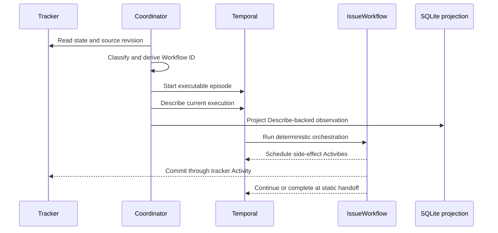
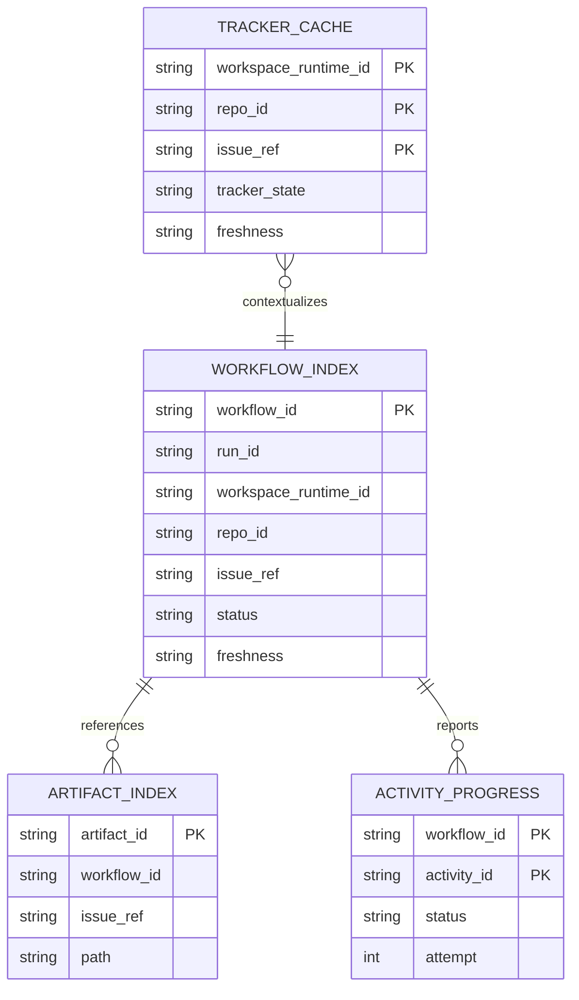

# Runtime authority, tracker state, and local projections

The central 2607 rule is that storage layers answer different questions. None should be promoted to replace another.

| Layer | Authoritative for | Not authoritative for |
| --- | --- | --- |
| Live tracker | external issue/business state and queueing between episodes | in-flight Temporal retry/order/history |
| Temporal Workflow state/history | deterministic per-episode orchestration, ordering, retry, Query state | external tracker fact unless a write is read back |
| SQLite local state | fast local aggregates, indexes, cache, freshness, diagnostics | start reservation, progression, or proof of Temporal absence |
| Filesystem artifacts | large transcripts, logs, reports, patches, traces | lifecycle decisions |
| Process memory | hot current-process values | durable correctness |

This authority model connects the [Temporal architecture](overview.md) to the [tracker lifecycle](../domain/lifecycle.md).

## Activation and episode ownership

Tracker state is a durable queue between executable episodes. The Coordinator only activates:

- `Todo`
- `In Progress`
- `Agent Review`
- `Rework`
- `Merging`

`Backlog`, `Need to Clarify`, `Need Human Input`, `Human Review`, and `Done` are static by default. Static means the tracker holds durable state without keeping an idle Workflow open.

This is the **Draft planned contract** from `WORKFLOW-ACTIVATION.md`; only pure classification/identity and the projector mechanics are implemented. The production launcher and full Workflow are not. **Tracking (verified 2026-07-28):** #502 is Todo and is the next T2607-03 Temporal-authoritative start slice; full Workflow behavior belongs to T2607-05/06, with no promoted Issues.

The episode Workflow ID is human-readable and Coordinator-derived from repository, issue, observed state, target kind, explicit UTC-second timestamp, and source identity. Temporal's `run_id` locates the exact execution. SQLite stores these values but must not construct or alter them (`src/symphony/coordinator/mod.rs`, `src/symphony/local_state/identity.rs`).

## Tracker commits

The proposed authority is `TrackerTransitionActivity`: Workflow requests a change, the Activity checks `expected_from_state`, writes, and verifies through targeted readback. DTOs and deterministic `symphony.transition.v1` idempotency are implemented, and the Activity name is registered. The Activity itself currently returns an explicit rejected/not-implemented result and performs no side effect (`src/symphony/activities.rs`; `TRACKER-TRANSITION-ACTIVITY.md`, **Partially implemented**). **Tracking (verified 2026-07-28):** #494 is Done only for the T2607-04 transition DTO/idempotency contract; no Issue is promoted for the remaining T2607-04 mutation, evidence, and reconcile slices.

Therefore:

- the planned single 2607 tracker commit authority does not yet operate;
- legacy 2606 adapters and lane mutation paths remain the proven implementation;
- no page or caller should claim that current `IssueWorkflow` moves tracker state.

## SQLite projection model

ADR 0007 (**Accepted**) defines one machine-shared database with five v1 tables:

- `workflow_index`
- `artifact_index`
- `tracker_cache`
- `activity_progress`
- `meta`

`LocalStateProjector` accepts authoritative observations supplied from outside. A StartResponse alone cannot establish required start time and cannot create a lifecycle row. Current Describe evidence can project `running`, `completed`, `failed`, or `closed_unknown`; immutable identity or stale evidence yields a typed no-write/conflict result. Although schema vocabulary also includes `starting`, `start_failed`, `stale_start`, and `stale_missing`, the v1 projector does not produce them.

`LocalStateReader` reads only persisted active rows. It does not infer freshness, “latest execution,” lifecycle, or that an execution is absent from Temporal. An SQLite unique-row conflict is a diagnostic to reconcile against Temporal, never permission to reject or reserve a start.

This is a conceptual view of the v1 indexed records; it does not imply implemented foreign keys or full reader support for every table.

## Reconciliation boundary

Reconciliation observes facts and repairs projections; it does not silently repair business state.

1. Read current Temporal Describe/history evidence.
2. Materialize that observation through `LocalStateProjector` when valid.
3. Leave conflicting/stale/unavailable evidence unchanged.
4. Route tracker/Temporal disagreement through explicit policy or [Doctor/operator recovery](../workflows/operator-workflows.md).

Planned triggers are App startup, visible-item refresh, and targeted Coordinator start. No background Symphony scanner is intended in 2607. These triggers and Temporal Describe integration are not yet wired. **Tracking (verified 2026-07-28):** targeted Coordinator repair belongs to T2607-03; #504 is its Backlog seed, while #502 is the Todo start slice that precedes it. App-trigger wiring belongs to T2607-07, which has no promoted Issue; #505 is only a bounded backend Backlog seed. Tracker-side transition reconciliation remains separate T2607-04 work with no promoted Issue.

## Change guidance

- Never authorize Workflow progression from SQLite or UI state.
- Never treat a tracker write call as committed until policy-required readback confirms it.
- Keep large evidence out of Temporal history and SQLite rows; store references.
- Preserve projection no-write outcomes when evidence is incomplete.
- When changing local schema or identities, start in `src/symphony/local_state/migration.rs`, `identity.rs`, projector tests, and reader tests; then run the checks in [Testing](../testing.md).
