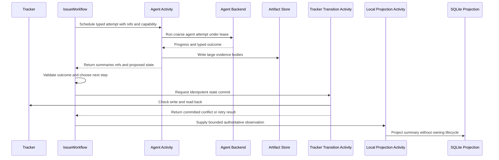

# Shea Symphony 2607 execution contracts

> **Status: Draft target design, not implemented behavior.** The milestone documents synthesized here are all labelled **Draft**, including implementation packages T2607-05 and T2607-06. The checked-in `src/symphony/**` runtime is a much narrower Temporal skeleton. This page is implementation guidance, not evidence of live tracker progress.

These contracts define how T2607-05 should put Main, Rework, Agent Review, Merge, Human Review validation, and Doctor behind coarse Activities, and how T2607-06 should make `IssueWorkflow` the durable owner of one executable episode. They refine the broader [authority model](authority-and-state.md), apply the executable/static states in the [issue lifecycle](../domain/lifecycle.md), and run on the worker topology in the [architecture overview](overview.md).

## Contract at a glance

This is the **Draft target flow**. Currently `IssueWorkflow` schedules only `NoopCoreActivity`; agent Activities return `not_implemented`; `TrackerTransitionActivity` is inert; and the Workflow does not schedule local projection (`src/symphony/workflows.rs`, `activities.rs`).

The non-negotiable authority rule is: **agent Activities report facts, evidence, and proposals; `IssueWorkflow` decides ordered progression; only the tracker transition boundary may commit tracker lifecycle state; SQLite receives rebuildable projections and never authorizes progression.**

## Durable Workflow state, not evidence storage

**Draft target contract.** `IssueWorkflowState` is small, serializable control state sufficient to replay, resume, decide, query, and locate evidence. It should retain activation identity, the last tracker state confirmed through the transition Activity, active step/attempt summaries, structured waiting state, last transition, terminal outcome, artifact references, and bounded PR/human-todo/health summaries. Full issue bodies, comments, workpads, transcripts, diffs, review reports, event streams, and worktree status remain outside Temporal history. Query handlers return replay-derived summaries without filesystem, tracker, SQLite, artifact, network, or process I/O (`ISSUE-WORKFLOW-STATE.md`; T2607-06).

Artifact references are durable Workflow data; artifact bodies are not. Dashboard-wide aggregation belongs in SQLite, while one active issue's runtime detail should come from a Temporal Query. This storage split is governed by [runtime authority and local projection boundaries](authority-and-state.md).

**Checked-in implementation.** `IssueWorkflowInput` already records compact activation context, and `IssueWorkflowState` contains only workflow/run/repository/issue identity, a tracker-state string, active step, optional terminal outcome, artifact refs, and a health summary. `current_state` returns a bounded projection. It does not yet contain waiting state, attempt summaries, transition summaries, PR state, or the Draft lane vocabulary, and the run currently ends as `completed_noop` (`src/symphony/dto.rs`, `workflows.rs`).

## Activity request, result, and capability boundary

**Draft target contract.** One `AgentActivityRequest` should identify the Workflow and attempt, issue and lane, backend, capability profile, assigned worktree reference, prompt/context references, artifact policy, heartbeat policy, timeout policy, and idempotency key. One `AgentActivityResult` should normalize the outcome and return a concise summary plus artifact/evidence/test refs, worktree summary, optional PR/review/Doctor facts, cancellation result, blocking reason, retry timing, and a **proposed** next state. Large context and output cross the boundary by reference rather than payload (`AGENT-ACTIVITY-CONTRACT.md`; T2607-05).

Temporal owns the coarse attempt boundary; Codex app-server and review backends keep their internal model/tool loops. A model turn is not a Workflow step. Runtime-enforced capability profiles—not prompt wording—must gate file writes, push/PR and merge access, safe local repair, readable paths, and lease requirements. The initial profiles are `read_only`, `code_write`, `merge_write`, `review_read_only`, `review_comment`, `review_safe_autofix`, `doctor_read`, `doctor_write_safe`, and `doctor_write_operator`. Automatic Doctor writes are limited to bounded, idempotent local repair; ambiguity, code changes, tracker-lane changes, destructive cleanup, permission changes, merge, or human judgment must route to NHI.

**Checked-in implementation.** `MainAgentActivity`, `ReworkActivity`, `AgentReviewActivity`, and `MergeActivity` have durable registered names, but all accept `NoopActivityRequest` and return `NoopActivityResult::not_implemented`. There is no shared agent request/result DTO, capability enum or enforcement, Doctor Activity registration, Human Review validation Activity, backend adapter, or normalized outcome mapping (`src/symphony/activities.rs`, `dto.rs`).

## Worktree lease and write ownership

**Draft target contract.** Every write-capable profile must receive a `WorktreeLease`, not choose a path itself. A lease binds repository, issue, path, branch/base, owning Workflow and Activity, mode, acquisition time, and optional expiry. The intended lifecycle is acquire or reuse at the Workflow boundary, pass the lease reference to the Activity, refresh liveness through heartbeat, return a worktree summary, then let the Workflow decide reuse, release, or cleanup. Read-only work may use a non-exclusive reference or snapshot. Missing, expired, or conflicting write ownership yields `conflict` or `need_human_input`, never an uncontrolled write.

**Checked-in implementation.** No lease DTO, lease Activity, lease liveness, or capability-to-lease enforcement exists in the inspected `src/symphony/workflows.rs`, `activities.rs`, or `dto.rs`. Agent placeholders do not touch worktrees.

## Layered progress and timeout policy

**Draft target contract.** Heartbeats must identify the layer that is alive or stuck: `temporal_activity`, `local_runner`, `codex_session`, `agent_run`, and optional `model_turn`. Temporal heartbeat data and SQLite `activity_progress` should hold only the latest bounded summary and refs; complete event streams remain artifacts. Distinct timeouts should separate queue delay (`schedule_to_start`), maximum Activity duration (`start_to_close`), wrapper liveness (`heartbeat_timeout`), Codex admission (`codex_queue_timeout`), lack of useful progress (`no_progress_timeout`), and optional model-turn diagnostics. Their expiry must be classified according to cleanup safety and backend health, not flattened into one generic timeout.

**Checked-in implementation.** The no-op Workflow sets only a 30-second `start_to_close` timeout. There are no heartbeat DTOs or calls, layered timeout policy, progress projection calls, or no-progress detection. `workers.rs` reports configured per-queue concurrency but the worker builders do not visibly apply those values, so enforcement remains unproven.

## Cancellation is an observed outcome

**Draft target contract.** Workflow cancellation requests child-session cancellation; it does not prove that Codex, a merge runner, or a local process stopped. The Activity result must separately report whether cancellation was requested, whether child termination was confirmed, whether the worktree is safe, evidence refs, and required follow-up. An unconfirmed child that may still mutate the worktree is `conflict` or `need_human_input`, not clean success.

**Checked-in implementation.** The Workflow defines no Signal or Update handlers and schedules no real child backend. Agent placeholders implement no cancellation request, confirmation, or worktree-safety result.

## Failure classes and retry ownership

**Draft target contract.** Activities normalize backend-specific results before Workflow routing:

| Class | Intended owner/action |
| --- | --- |
| `success`, `already_applied` | Workflow continues after required evidence/readback. |
| `retryable` | Temporal retries transient infrastructure failure conservatively. |
| `wait_and_retry` | Workflow uses provider delay, Activity retry delay, or durable timer while retaining visible ownership. |
| `need_human_input` | Workflow creates structured waiting data and requests the tracker transition through the commit boundary. |
| `conflict` | Workflow stops guessing and reconciles or routes to NHI. |
| `rejected` | Workflow follows a normal business edge such as Todo to NTC or Agent Review to Rework. |
| `terminal_noop` | Workflow completes without retry when work is already terminal or cancelled. |
| `unhandled_error` | Non-retryable invariant/contract failure preserves history and evidence for diagnosis. |

Retries are for transient faults, not semantic uncertainty, missing credentials, policy refusal, or destructive operations without explicit idempotency and readback. Rate and usage limits favor durable waiting. Every NHI result must carry a stable reason, requested action, resume target, artifact refs, and whether retry is possible (`ACTIVITY-ERROR-TAXONOMY.md`).

**Checked-in implementation.** Agent placeholders expose only string outcomes such as `not_implemented`. The typed tracker-transition DTO does implement a narrower result enum (`Committed`, `AlreadyApplied`, `Conflict`, `Rejected`, `RetryLater`, `NeedHumanInput`, `UnhandledError`) and stable `symphony.transition.v1` idempotency, but the Activity always returns `Rejected` with an explicit inert summary. The Workflow neither schedules that Activity nor routes any typed failure (`src/symphony/dto.rs`, `activities.rs`, `workflows.rs`).

## Per-issue ordering, worker parallelism, and queue isolation

**Draft target contract.** At most one active `IssueWorkflow` execution should own ordered decisions for an issue. Signals and Updates enter one history and are processed in history order, but handlers must still validate current tracker state, allowed action, capability/expiry, evidence, payload shape, and duplicate policy. External fact changes—tracker transitions, PR linking, merge, terminal writes, and claim cleanup—remain serial, idempotent, and readback-verified per issue. Parallelism comes from separate issue Workflows and non-conflicting Activities, not a second scheduler or per-model-turn graph (`TEMPORAL-CONCURRENCY.md`).

The Draft queue split assigns control and tracker commits to `symphony-core`, long-running agents to `symphony-agent`, and projection/index/health work to `symphony-local`. Initial design caps are 3, 3, and 8 Activities, with tighter per-issue serialization. Static tracker states consume no worker capacity unless an executable episode is started (`TASK-QUEUES.md`).

**Checked-in implementation.** The three names, Workflow/Activity registration split, and configured 3/3/8 values exist. Core owns `IssueWorkflow`; agent and local workers are Activity-only. No code in the inspected files enforces one active Workflow or agent attempt per issue, per-issue mutation locks, worktree lease exclusion, or the Draft Activity sub-limits (`src/symphony/task_queues.rs`, `workers.rs`).

## Signals versus Updates

**Draft target contract.** Use **Updates** on an appropriate open Workflow for state-changing operator actions that require synchronous acceptance or rejection, including human input, Human Review approval, request-rework, human fix, Doctor handoff, and cancellation. Use **Signals** for low-risk supplemental notes or evidence that may be accepted asynchronously. History ordering is not authorization: every handler must validate lifecycle state and the scoped operator action context. Static NHI and Human Review normally end an episode; a routed action or Doctor/reconciliation must establish an executable tracker state before a later activation, consistent with the [lifecycle contract](../domain/lifecycle.md). The Draft documents do not specify which open execution receives an action after the prior static-handoff Workflow has closed; the action-bootstrap or new-episode target is unresolved and unimplemented, as detailed in [App and operator integration](app-operator-integration.md).

**Checked-in implementation.** `IssueWorkflow` exposes only the `current_state` Query. It has no Signal or Update methods, operator-action validation, waiting/resumption logic, or executable handler dispatch (`src/symphony/workflows.rs`).

## Lifecycle commit and projection prohibitions

**Draft target contract.** Agent Activities may modify their leased worktree within capability, produce artifacts, and propose a next state. They must not choose canonical worktrees, commit tracker lanes, decide final lifecycle state, update SQLite Workflow indexes, or treat prompt text as permission. `IssueWorkflow` alone interprets typed Activity outcomes and requests lifecycle commits. `TrackerTransitionActivity` alone applies a tracker transition with an expected-state precondition, stable idempotency, and targeted readback. Local projection receives already-authoritative observations; projection failure marks freshness stale or failed and cannot change Workflow or tracker truth.

This separates Symphony's durable control from Shea semantics: Temporal orchestrates, agent backends implement or review, Shea evaluates product semantics, and the tracker transition boundary commits external state (`RUNTIME-ROLE-MAPPING.md`). It also prevents the app, Doctor, review tools, and SQLite from becoming backdoor lifecycle writers; operator and recovery behavior remains governed by [operator workflows](../workflows/operator-workflows.md).

**Checked-in implementation.** The module comments enforce the architectural separation, and the transition request/result DTO is compact and history-safe. However, no checked-in agent Activity performs product work, no Workflow calls the transition Activity, the transition Activity performs no tracker I/O, and local projection Activities are placeholders. The prohibition is an implementation requirement, not proof that the planned end-to-end authority path exists.

## T2607-05/06 implementation order

1. **Define shared contracts first.** Add versionable agent request/result, artifact ref, outcome, capability, heartbeat, timeout, cancellation, worktree lease, waiting, attempt-summary, and transition-summary DTOs. Keep durable names and serialized fields backward-compatible.
2. **Enforce capability and lease boundaries before enabling writes.** A prompt cannot substitute for runtime checks. Test that write-capable attempts fail closed without a valid lease and that review/Doctor cannot reach forbidden tracker or merge operations.
3. **Wrap proven 2606 behavior behind coarse Activities.** Reuse Codex event normalization, lane semantics, review decisions, merge policy, Doctor findings, and tracker adapters without copying the old durable loop into Temporal.
4. **Normalize outcomes at each Activity boundary.** Preserve backend detail in artifacts, return the shared class to Workflow code, and distinguish business rejection from retryable infrastructure failure.
5. **Implement deterministic handlers and ordered routing.** Start from Todo, In Progress, Agent Review, Rework, or Merging; internally chain executable handlers; complete only at static handoff, Done, cancellation, or unhandled error.
6. **Centralize commits and readback.** Schedule the existing transition contract rather than writing from agent code. Never update `current_tracker_state` merely because an agent proposed a state.
7. **Add Queries, Updates, Signals, and projections last.** Query only durable summaries. Validate actions synchronously through Updates where needed. Project observations for display without making SQLite an authorization source.

Run the relevant checks in [Testing](../testing.md), including DTO serialization, durable type registration, deterministic Workflow behavior, retry/idempotency, no-op Temporal smoke, and targeted tests for each migrated 2606 lane. Add explicit tests proving forbidden tracker/SQLite mutation paths and cancellation ambiguity; registration tests alone do not prove behavior.

## Primary evidence and status

All design sources below are **Draft**: `docs/milestones/2607-hardening/ISSUE-WORKFLOW-STATE.md`, `AGENT-ACTIVITY-CONTRACT.md`, `ACTIVITY-ERROR-TAXONOMY.md`, `TEMPORAL-CONCURRENCY.md`, `TASK-QUEUES.md`, `ISSUE-WORKFLOW.md`, `RUNTIME-ROLE-MAPPING.md`, `implementation/T2607-05-agent-activity-boundary.md`, and `implementation/T2607-06-issue-workflow-state-machine.md`.

Current implementation evidence is limited to `src/symphony/workflows.rs`, `activities.rs`, `dto.rs`, `workers.rs`, and `task_queues.rs`. Re-check those files before relying on this gap analysis, because durable Temporal contracts can evolve independently of the Draft documents.
