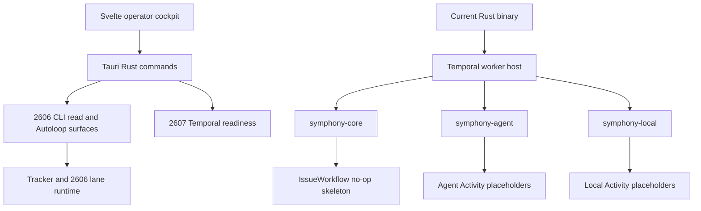

# Runtime architecture and 2606/2607 boundary

## Two generations, one migration

The reusable crate deliberately exposes both generations: legacy modules implement the 2606 MVP, while `src/symphony/**` establishes the 2607 Temporal execution boundary (`src/lib.rs`). [Lifecycle semantics](../domain/lifecycle.md) come from the proven 2606 workflow, but 2607 relocates durable orchestration into Temporal rather than preserving Autoloop as a second authority.

2607 Hardening is explicitly **Draft** (`docs/milestones/2607-hardening/README.md`). ADR 0006, which proposes local Temporal as the runtime spine, remains **Proposed** even though current `src/main.rs` and `src/symphony/**` already realize parts of it. Preserve those statuses; implementation does not silently accept an ADR.

This shows the checked-in current-main integration: the app remains mostly 2606-facing while the default binary hosts the partial 2607 worker topology.

## 2607 component responsibilities

### Temporal client and worker host

- `src/main.rs` loads `.shea/workflows/shea-symphony.md` and calls `run_symphony_workers`.
- `src/symphony/client.rs` provides service readiness, Workflow start, query, and result retrieval.
- `src/symphony/worker_runtime.rs` starts core, agent, and local workers in one process.
- `src/symphony/workers.rs` registers durable Workflow and Activity names.

The queues separate latency-sensitive orchestration from expensive agents and short local projection work:

| Queue | Intended ownership | Checked-in implementation |
| --- | --- | --- |
| `symphony-core` | `IssueWorkflow`, tracker commits, control plane | Workflow plus successful no-op and inert tracker transition |
| `symphony-agent` | Main, Rework, Review, Merge attempts | Registered Activities returning `not_implemented` |
| `symphony-local` | projection, indexing, local health | projection/index placeholders; local health succeeds without writes |

The workflow config declares concurrency 3/3/8. `task_queue_registrations` reports these limits, but the inspected `WorkerOptions` builders do not visibly apply them; treat enforcement as unproven rather than implemented.

### IssueWorkflow

[Authority and state](authority-and-state.md) places deterministic in-flight decisions in `IssueWorkflow`; all I/O must cross an Activity boundary. Current `src/symphony/workflows.rs` only schedules `NoopCoreActivity`, records `completed_noop`, and exposes a `current_state` Query. It does **not** yet implement lane routing, signals/updates, tracker transitions, Human Review, NHI resumption, or the proposed durable state machine in `docs/milestones/2607-hardening/ISSUE-WORKFLOW.md` (**Draft**).

### Workflow Coordinator

`src/symphony/coordinator/mod.rs` implements the pure portion of [workflow activation](authority-and-state.md): classify an observed tracker state, enforce optional optimistic expectations, derive `work`, `review`, `rework`, or `merge`, and build a bounded episode Workflow ID from explicit inputs. It performs no I/O. Production tracker observation, Temporal start/Describe, capacity admission, and projection wiring remain absent.

### Local SQLite

The local database is the most mature 2607 subsystem. ADR 0007 is **Accepted**. `src/symphony/local_state/**` implements schema/migration, typed identity, health/admin, Describe-backed projection, and narrow active-row reads. It is not yet connected to Coordinator or the App; see [Authority and state](authority-and-state.md).

### Desktop app

`app/src/OperatorDesk.svelte` and `app/src/lib/**` present queues, Human Todo, lane evidence, and handoffs. Tauri commands in `app/src-tauri/src/read_surfaces.rs` still shell out to legacy CLI JSON surfaces, while `app/src-tauri/src/autoloop.rs` controls the 2606 loop. `app/src-tauri/src/temporal_health.rs` is the direct 2607 seam: a bounded, read-only readiness probe through the shared client. [2607 App and operator integration](app-operator-integration.md) contrasts this implementation with the Draft T2607-07 dashboard, direct Temporal, and routed-action target.

## 2606 relationship

2606 is not synonymous with 2607 and is not a second supported durable runtime inside the 2607 design. It is:

- the protected operational fallback;
- the source of proven Main/Review/Merge/Doctor semantics;
- migration reference code still present in legacy modules;
- the runtime expected by many current app and operator docs.

2607 aims to preserve behavior while changing ownership: [tracker commits become Activities](authority-and-state.md), executable progression becomes Workflow state, and top-level reads become local projections. Current `main` has crossed the binary-entrypoint boundary before the product workflow migration is complete.

## Change guidance

- Changing Workflow/Activity names or DTO serialization requires a Temporal history compatibility plan.
- Do not put tracker, network, filesystem, SQLite, process, or clock I/O in Workflow code.
- Do not interpret placeholder registration as feature completion.
- Keep the desktop and legacy CLI coupling visible until T2607-07 is actually implemented.
- Use [Testing](../testing.md) for queue registration, no-op smoke, app, and migration checks.
