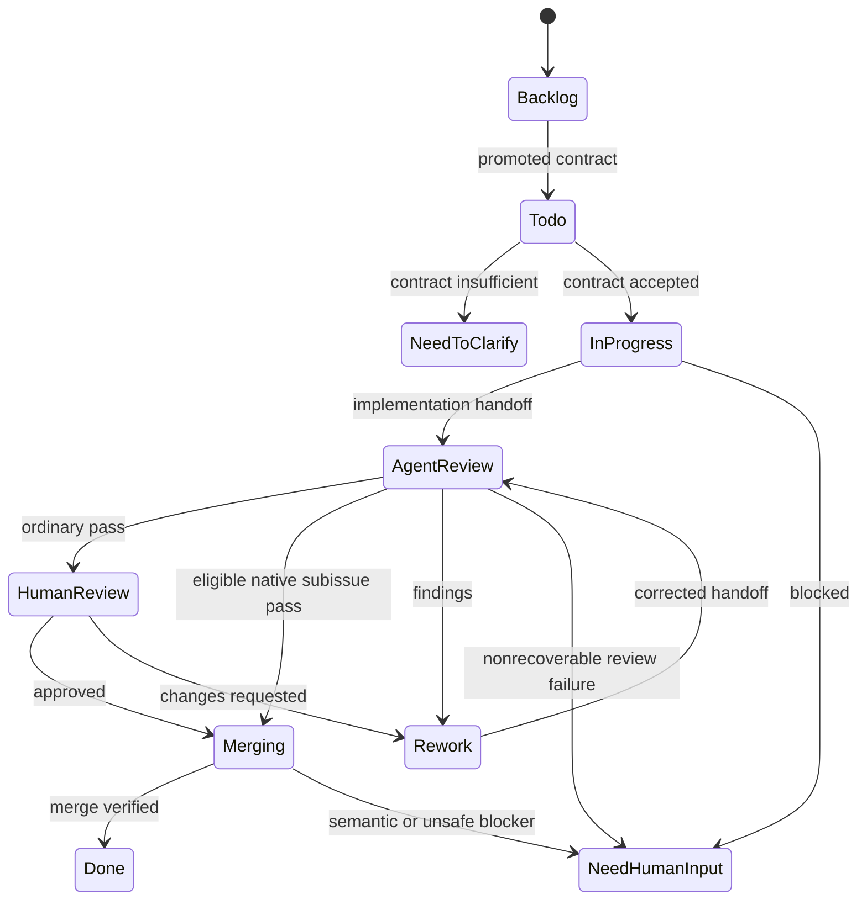

# Issue lifecycle and human gates

The checked-in workflow maps ten standard tracker states (`.shea/workflows/shea-symphony.md`). In 2607, states also determine whether the [Coordinator may activate a Temporal episode](../architecture/authority-and-state.md).

| State | 2607 activation class | Meaning |
| --- | --- | --- |
| Backlog | Static | Candidate work, not dispatchable implementation |
| Todo | Executable | Contract check and implementation entry |
| Need to Clarify (NTC) | Static | Issue contract is not executable or has become stale |
| In Progress | Executable | Main implementation work |
| Need Human Input (NHI) | Static | Operational/product decision, credential, unsafe action, or unresolved blocker |
| Agent Review | Executable | Independent agent review |
| Human Review | Static | Explicit operator UAT/approval gate |
| Rework | Executable | Correct findings or requested changes |
| Merging | Executable | Land approved work and repair safe mechanical drift |
| Done | Static/terminal | Completed external state |

The Coordinator implementation classifies these groups now; the complete 2607 state machine remains **Draft** and unimplemented. **Tracking:** implementation belongs to T2607-05/06; no Issues are promoted for either package.

This captures principal evidenced routing, not every administrative or cancellation edge.

## Role and evidence boundaries

- **Main** owns implementation and must stop at `Agent Review`; it cannot approve its own work.
- **Review** is independent. Confirmed findings go to `Rework`. Ordinary passes go to `Human Review`; routine native subissues may go directly to `Merging` when the parent owns final UAT (`src/review/decision.rs`).
- **Human Review** is an explicit operator decision after reading issue, PR, workpad, review evidence, completion criteria, and UAT contract. The handoff prompt forbids mutation before approval (`.shea/prompts/human-review-handoff.md`).
- **Merge** owns clean landing and safe mechanical repair. Real semantic uncertainty, unsafe state, failed verification, missing evidence, or infrastructure blockers route to NHI.
- **Doctor** diagnoses stuck state and coordinates bounded, confirmation-gated repair; it does not become hidden implementation, Human Review, or merge authority.

Evidence normally spans issue contract, Main workpad, timeline comments, linked PR, lane claims, session/runtime records, and local artifacts. [Operator workflows](../workflows/operator-workflows.md) explains how humans use these surfaces.

## NTC versus NHI versus Human Review

These states are all presented as Human Todo in the desktop app, but they ask different questions:

- **NTC:** “Is the issue contract clear and executable?” It routes to Issue Forge guidance. Main should use it for missing scope, dependencies, acceptance evidence, or stale assumptions before work can safely proceed.
- **NHI:** “What decision, permission, credential, or recovery choice is needed?” It routes to Doctor guidance. Evidence should name the blocker and the smallest operator action needed.
- **Human Review:** “Does this already reviewed result satisfy human-owned UAT and approval?” It routes to the Human Review skill and gates ordinary merge.

Do not use NHI as a generic failure bucket when a deterministic retry is safe, and do not use NTC for operational failures unrelated to the issue contract.

## Tracker and runtime interaction

The tracker is durable external business state, while Temporal is intended to own in-flight episode decisions. A static tracker lane normally ends an active episode; a later explicit tracker/operator action creates a new executable condition. See [Authority and state](../architecture/authority-and-state.md) for why local projections cannot resume work on their own.

Current 2606 lane code implements these transitions through legacy tracker adapters. Current 2607 code implements the classification contract but not operational routing or tracker commits. Treat `docs/milestones/2607-hardening/ISSUE-WORKFLOW.md` as **Draft planned design**, not observed runtime behavior.

## Known policy drift

`src/doctor/project_state.rs` still suggests moving a dirty/not-clean merging PR to Rework, while newer merge guidance keeps safe repair in `Merging` and sends unresolved semantic/unsafe blockers to NHI (`.shea/prompts/merge-agent.md`, `docs/operator-dogfood.md`). #390 is Done and established that newer merge-agent policy; it is not an active repair Issue. **Tracking:** any retained 2606 Doctor repair is an unowned gap or removable under T2607-08, for which no Issue is promoted. Surface the conflict when touching Doctor diagnostics; do not silently pick one policy.

## Change guidance

- Update the state map, prompts, decision code, Doctor checks, UI Human Todo mapping, and tests together when lifecycle vocabulary changes.
- Preserve review independence and explicit human approval.
- Route direct state writes through the current generation's owning boundary: legacy adapter paths in 2606, planned `TrackerTransitionActivity` in 2607.
- Use [Testing](../testing.md) for review routing, parked-state, Doctor, and UI handoff coverage.
