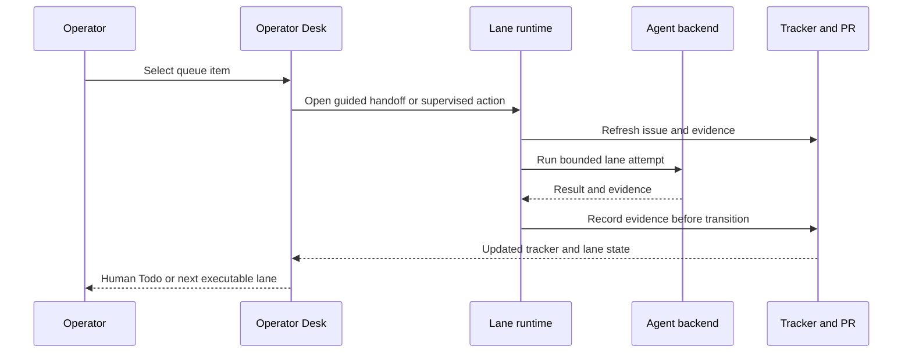

# Operator workflows, Doctor, and human handoffs

This page maps operator intent to canonical source material; it does not replace the detailed runbooks. The [lifecycle model](../domain/lifecycle.md) defines routing, while [authority and state](../architecture/authority-and-state.md) defines which evidence may authorize action.

## Normal 2606 lane workflow

The mature operational flow exists in the protected 2606 runtime and legacy modules:

1. **Shape/inspect the contract.** Todo must be dispatchable; otherwise route to NTC.
2. **Main implementation.** Claim the issue, prepare/resume its isolated worktree, run the configured agent, verify, publish/link the PR, record the Main workpad, and hand off to Agent Review.
3. **Independent Review.** Read the issue/PR/evidence, run the review backend, record a durable verdict, then route to Rework, Human Review, Merging for eligible subissues, or NHI for nonrecoverable blockers.
4. **Human Review.** Brief the operator on evidence and remaining UAT. No approval, rejection, routing, merge, or tracker mutation occurs before explicit operator approval.
5. **Merge.** `merge once` and `merge loop` land clean approved work through direct deterministic CLI logic; they do not require Codex or another agent session. The CLI first handles safe mechanical drift within merge authority, uses the configured merge-agent backend only for explicit diagnosis or bounded content-conflict repair, and escalates semantic uncertainty or unsafe state to NHI.

Canonical detail: `README.md`, `docs/main-orchestration-spine.md`, `docs/operator-dogfood.md`, and lane prompts under `.shea/prompts/`.

This is the implemented 2606 interaction pattern; the 2607 equivalent is planned to move lane attempts behind Temporal Activities.

## Human Todo handoffs

The desktop aggregates NTC, NHI, and Human Review into Human Todo but loads a state-specific repository prompt:

- `.shea/prompts/need-to-clarify-handoff.md` opens Issue Forge discussion and prohibits issue creation/promotion before approval.
- `.shea/prompts/need-human-input-handoff.md` opens Doctor diagnosis and prohibits repair/state mutation before approval.
- `.shea/prompts/human-review-handoff.md` opens the Human Review workflow and requires explicit approval before routing.

Recent history made these prompts file-defined so operator wording is versioned and testable (`c316894`). Changes should preserve template variables and update `app/test/operator-view.test.mjs`.

## Doctor

Doctor has two related surfaces:

- The deterministic 2606 `doctor` command hydrates tracker evidence, runtime/session state, workspaces/topology, canonical checkout, and skill installation health; it supports human, JSON, TUI, strict, and limited write paths (`src/commands/doctor.rs`).
- Doctor v1 is a repo-owned operator workflow (`docs/operator-doctor.md`, **Status: Doctor v1**) that is read-first, evidence-preserving, and confirmation-gated.

Use Doctor for NHI, missing PR linkage, draft handoff, stale claim, dirty runtime/worktree, skill install symptoms, or other stuck-state diagnosis. A safe run:

1. Read live tracker, PR, runtime/session, worktree, and existing workpad evidence.
2. Separate observation from inference and classify one primary blocker.
3. Recommend the smallest repair that preserves evidence.
4. State whether it can run in the current session.
5. Require explicit confirmation for tracker changes, PR-ready changes, claim repair, cleanup, runtime cleanup, or skill writes.
6. Record durable evidence before terminal routing.

Implemented deterministic repair is narrower than the operator spec: invalid Human Review can return to Agent Review, a draft PR can be marked ready only with explicit confirmation, and explicit escalation to NHI is supported. Doctor must never move an issue to Human Review or merge a PR.

## Interrupted 2606 recovery

The canonical recovery runbook is `docs/operator-dogfood.md`:

- inspect `status` and Doctor before clearing or retrying anything;
- use bounded foreground Autoloop for normal all-lane recovery;
- use focused Main or Merge loops only to isolate recovery;
- Main recovery reuses matching worktree/session evidence and still requires verification, PR linkage, and ready-for-review checks;
- Merge recovery adopts structured claims; clean `merge once`/`merge loop` retries remain direct CLI work, while a Codex or other configured merge-agent session is reserved for explicit diagnosis or bounded repair after direct mechanical handling cannot safely finish;
- safe repair remains in Merging, while semantic uncertainty and serious blockers route to NHI;
- run cleanup audit only after evidence is preserved.

Do not apply these commands blindly on current `main`: the default binary is now the [2607 worker host](../architecture/overview.md). Use the protected 2606 branch or an explicitly configured 2606 runtime as described in [Operations](../operations.md).

## 2607 operator target

The **Draft** design makes the App primary, with Tauri calling Temporal start/query/signal/update and SQLite serving top-level snapshots. Operator flows submit structured actions through an Operator Action Bridge; tracker mutation remains inside Activities. That target is not implemented beyond readiness probing, pure contracts, and local-state foundations.

## Change guidance

- Preserve evidence before state mutation.
- Keep Main, Review, Human Review, Merge, and Doctor authority separate.
- Prefer tracker adapter/command surfaces over raw Project writes; raw writes are break-glass and should be recorded.
- Treat stale or conflicting evidence as a reason to stop and reconcile, not guess.
- Run the workflow-specific checks in [Testing](../testing.md).
